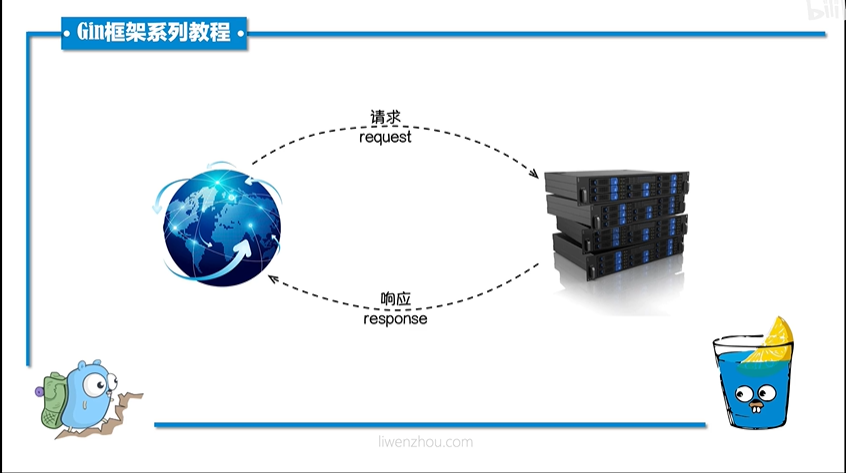
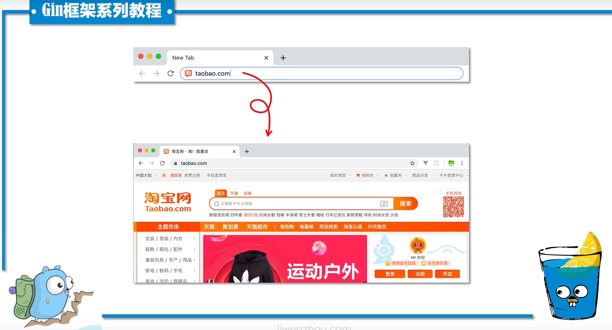
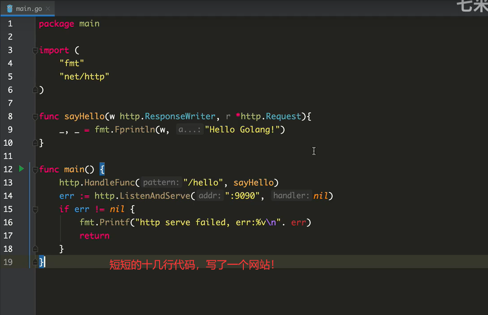
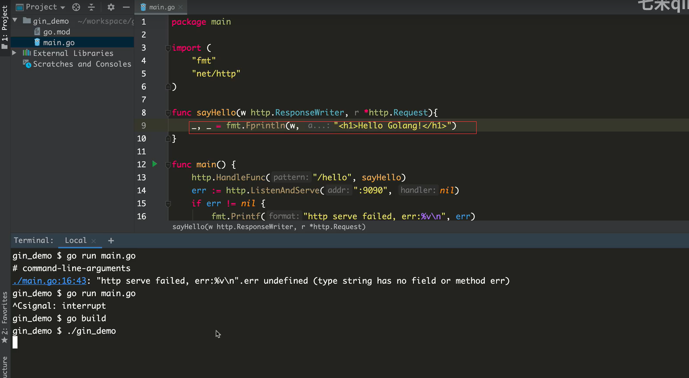
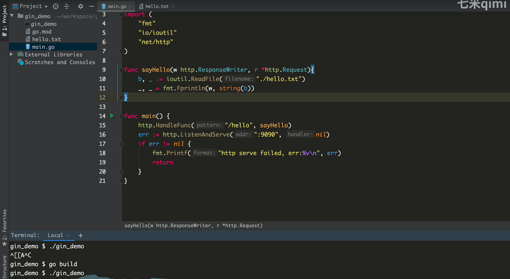
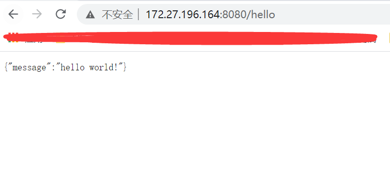

# web本质

> **关于Web**

- Web是基于HTTP协议进行交互的应用网络
- Web就是通过使用浏览器/APP访问各种资源





一个请求对应一个响应

**请求  ---  响应**




# http原生路由







```shell
package main

import (
	"net/http"
	"fmt"
)

func h1(w http.ResponseWriter, r *http.Request) {
	_, _ = fmt.Fprintln(w, "Hello Golang!")
}

func main() {
	http.HandleFunc("/hello", h1)
	
	err := http.ListenAndServe(":9000", nil)
	if err != nil {
		fmt.Printf("http serve failed, err:%v\n", err)
		return
	}
}
```





```shell
package main

import (
	"fmt"
	"io/ioutil"
	"net/http"
)

func h2(w http.ResponseWriter, r *http.Request){
	b, _ := ioutil.ReadFile("hello.txt")
	_, _ = fmt.Fprintln(w, string(b))
}

func main() {
	http.HandleFunc("/hello", h2)
	
	err := http.ListenAndServe(":9000", nil)
	if err != nil {
		fmt.Printf("http serve failed, %v\n", err)
	}
}
```


# gin框架初识


Gin is a web framework written in Go (Golang). It features a martini-like API with performance that is up to 40 times faster thanks to [httprouter](https://github.com/julienschmidt/httprouter). If you need performance and good productivity, you will love Gin.

Gin是用Go（Golang）编写的Web框架。它具有类似于martini的API，其性能比[httprouter](https://github.com/julienschmidt/httprouter)快40倍。如果您需要性能和良好的生产力，您会喜欢Gin的。


## Gin框架介绍

Go世界里最流行的Web框架，[github](https://github.com/gin-gonic/gin)上有 `46k`star, 基于 `httprouter`开发的Web框架。[中文文档](https://gin-gonic.com/zh-cn/docs/)齐全,简单易用的轻量级框架。


## Gin框架安装与使用

### 安装

下载并安装 `Gin`

```shell
go get -u github.com/gin-gonic/gin
```

### 第一个Gin示例：

```shell
package main

import (
	"gihtub.com/gin-gonic/gin"
)

func main() {
	// 创建一个默认的路由引擎
	r := gin.Default()
	// GET: 请求方式; /hello:请求的路径
	// 当客户端以GET方法请求/hello 路径时，会执行后面的匿名函数
	r.GET("/hello", func(c *gin.Context) {
		// c.JSON: 返回JSON格式的数据
		c.JSON(200, gin.H{
			"message": "hello world!"，
		})
	})
	
	// 启动HTTP服务，默认在0.0.0.0:8080启动服务
	r.Run()
}
```

将上面的代码保存并编译执行，然后使用浏览器打开 `127.0.0.1:8080/hello` 就能看到一串JSON字符串。




# RESTful API

REST与技术无关，代表的是一种软件架构风格，REST是Representational State Transfer的简称，中文翻译为"表征状态转移"或“表现层状态转化”。


推荐阅读 [阮一峰 理解RESTful架构](http://ruanyifeng.com/blog/2011/09/restful.html)

简单来说，REST的含义就是客户端与Web服务器之间进行交互的时候，使用HTTP协议中的4个请求方法代表不同的动作。

- GET用来获取资源
- POST用来新建资源
- PUT用来更新资源
- DELETE 用来删除资源

只要API程序遵循了REST风格，那就可以称其为RESTful API。目前在前后端分离的架构中，前后端基本都是通过RESTful API来进行交互。

例如，我们现在要编写一个管理书籍的系统，我们可以查询对一本书进行查询、创建、更新和删除等操作，我们在编写程序的时候就要涉及客户端浏览器与我们Web服务器交互的方式和路径。按照经验我们通常会设计成如下模式：

| 请求方法 | URL          | 含义         |
| -------- | ------------ | ------------ |
| GET      | /book        | 查询书籍信息 |
| POST     | /create_book | 创建书籍记录 |
| POST     | /update_book | 更新书籍信息 |
| POST     | /delete_book | 删除书籍信息 |

同样的需求我们按照RESTful API设计如下：

| 请求方法 | URL   | 含义         |
| -------- | ----- | ------------ |
| GET      | /book | 查询书籍含义 |
| POST     | /book | 创建数据记录 |
| PUT      | /book | 更新数据     |
| POST     | /book | 删除书籍信息 |

Gin框架支持开发RESTful API的开发

```shell
func main() {
	r := gin.Default()
	r.GET("/book", func(c *gin.Context) {
		c.JSON(200, gin.H{
			"message": "GET",
		})
	})
	
	r.POST("/book", func(c *gin.Context) {
		c.JSON(200, gin.H{
			"message": "POST",
		})
	})
	
	r.PUT("/book", func(c *gin.Context) {
		"message": "PUT",
	})
	
	r.DELETE("/book", func(c *gin.Context) {
		c.JSON(200, gin.H{
			"message": "DELETE",
		})
	})
}
```

开发RESTful API 的时候我们通常使用[Postman](https://www.postman.com/)来作为客户端的测试工具。


# Gin渲染


## Go语言标准库之http/template

`html/template`包实现了数据驱动的模板，用于生成可防止代码注入的安全的HTML内容。它提供了和`text/template` 包相同的接口，Go语言中输出HTML的场景都应使用`html/template`这个包


## 模板与渲染

在一些前后端不分离的Web架构中，我们通常需要在后端将一些数据渲染到HTML文档中，从而实现动态的网页（网页的布局和样式大致一样，但展示的内容并不一样）效果。

我们这里说的模板可以理解为事先定义好的HTML文档文件，模板渲染的作用机制可以简单理解为文本替换操作-使用相应的数据去替换HTML文档中事先准备好的标记。

很多编程语言的Web框架中都使用各种模板引擎，比如Python语言中Flask框架中使用的jinjia2模板引擎。


## GO语言的模板引擎

Go语言内置了文本模板引擎`text/template`和用于HTML文档的`html/template`。它们的作用机制可以简单归纳如下：

- 模板文件通常定义为.tmpl和.tpl为后缀（也可以使用其他的后缀），必须使用UTF8编码。
- 模板文件中使用{{和}}包裹和标识需要传入的数据。
- 传给模板这样的数据就可以通过点号 (.)来访问，如果数据是复杂类型的数据，可以通过{{.FieldName}}来访问它的字段。
- 除{{和}}包裹的内容外


## 模板引擎的使用

Go语言模板引擎的使用可以分为三部分：定义模板文件、解析模板文件和模板渲染


### 定义模板文件

其中，定义模板文件时需要我们按照相关语法规则去编写，后文会详细介绍。


### 解析模板文件

上面定义好模板文件之后，可以使用下面的常用方法去解析模板文件，得到模板对象：

```shell
func (t *Template) Parse(src string) (*Template, error)
func ParseFiles(filnames ...string) (*Template, error)
func ParseGlob(pattern string) (*Template, error)
```

当然，你也可以使用`func New(name string) *Template`函数创建一个名为 `name`的模板，然后对其其调用上面的方法去解析模板字符串或模板文件。


### 模板渲染

渲染模板简单来收就是使用数据区填充模板，当然实际上可能会复杂很多。

```shell
func (t *Template) Execute(wr io.Writer, data interface{}) error
func (t *Template) ExecuteTemplate(wr io.Writer, name string, data interface{}) error
```


## HTML渲染

我们首先定义一个存放模板文件的`templates`文件夹，然后在其内部按照业务分别定义一个`posts`文件夹和一个`users`文件夹，`posts/index.html`文件的内容如下：


