# 为什么要学习Go？

>[李文周讲师视频链接](https://www.bilibili.com/video/BV1wy4y1r73r)

## 目录

### Go语言介绍

#### 什么是Go语言？

- Google开源

  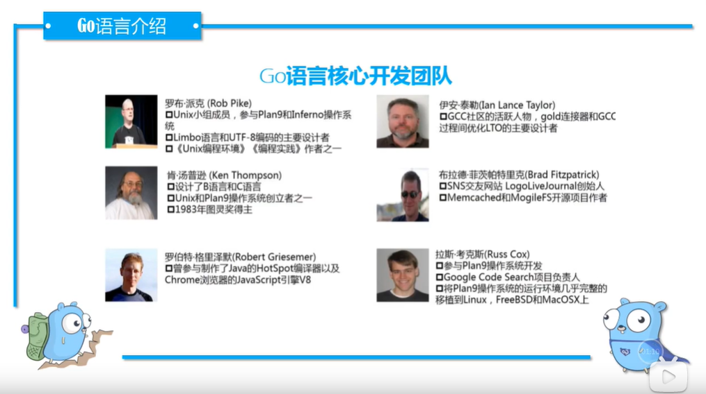

  

- 编译型

  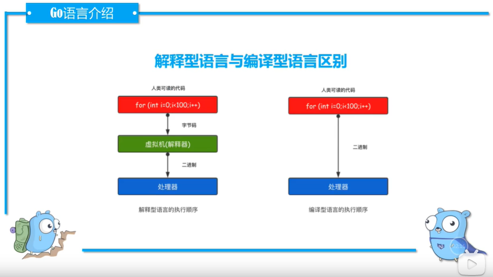

  

- 21世界的C语言

  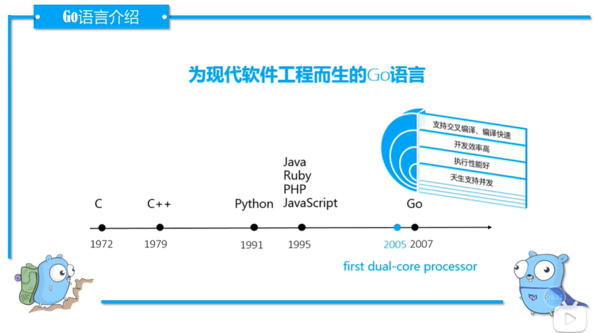

  2005年多核处理器（CPU）才诞生

  GO语言的特点：

  1. 语法简洁
  2. 开放效率高    自带垃圾回收机制
  3. 执行性能好

### Go语言发展现状及前景

​		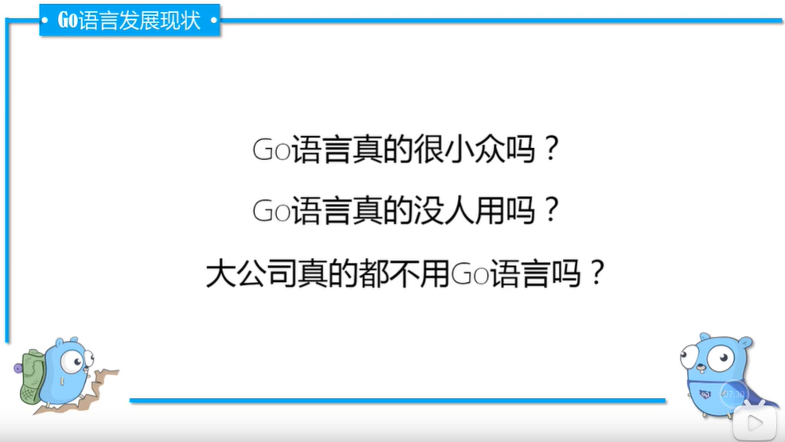

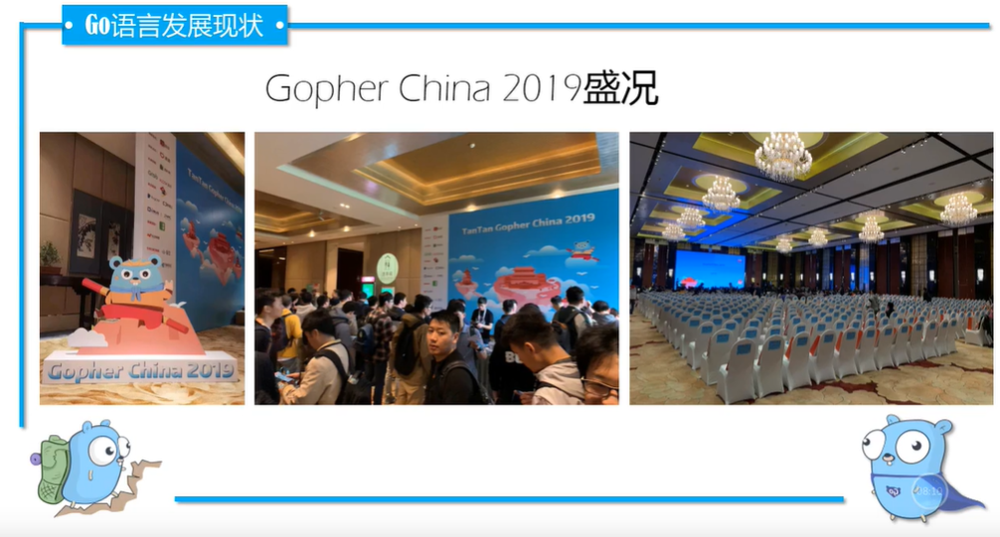

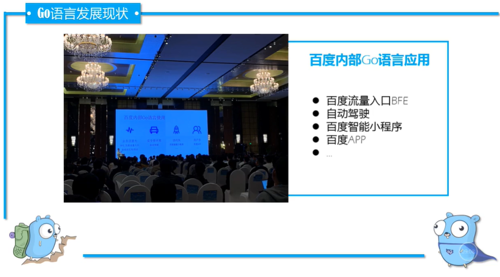

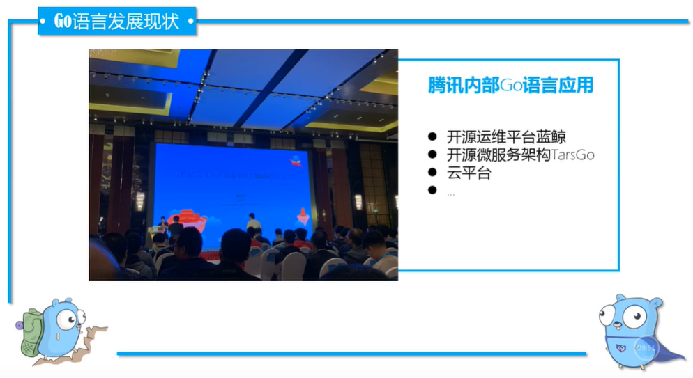

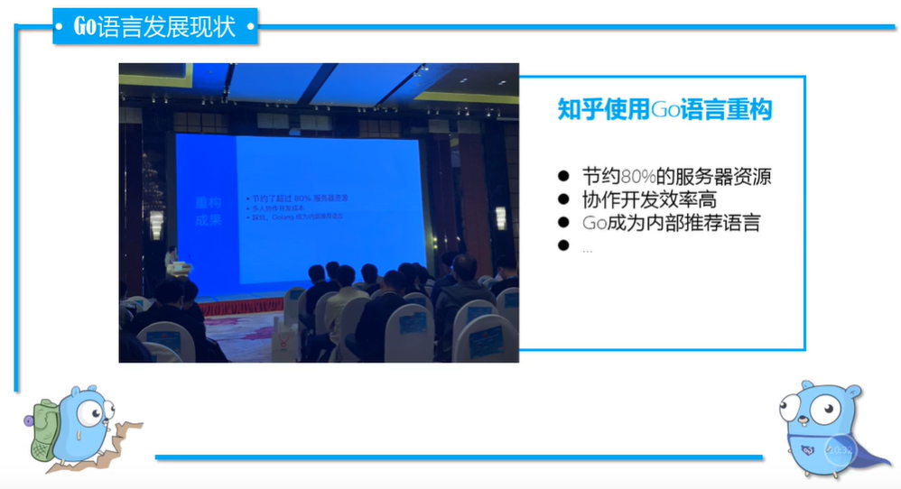

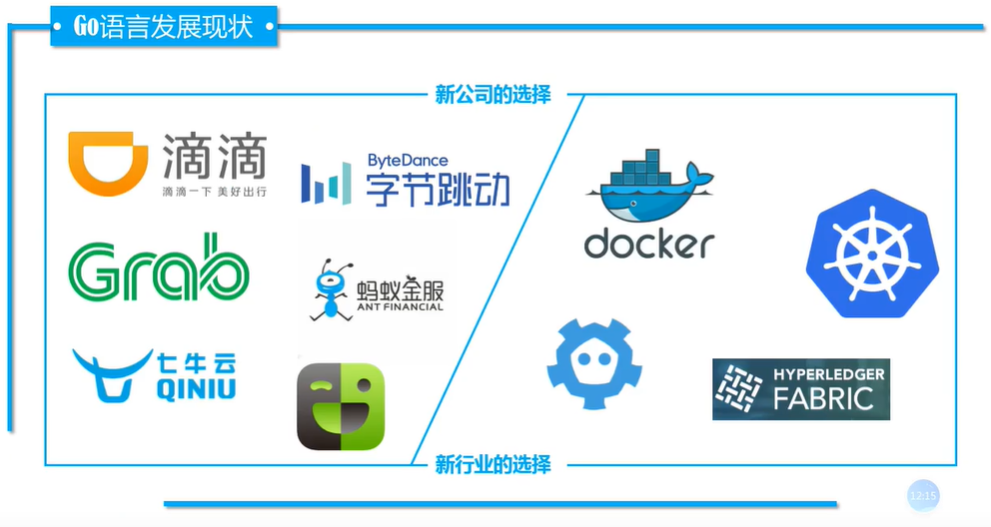

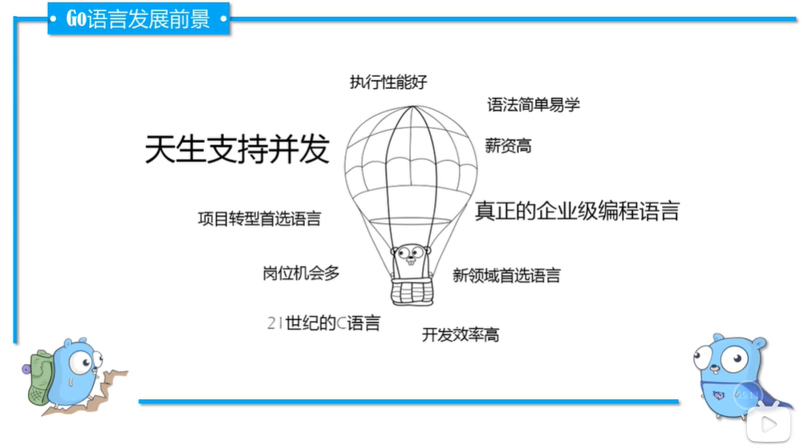

### 课程介绍

**课程内容**

- 8周Go语言基础
- 3个实战项目（含1个线上项目）
- 每周作业+课后答疑

**如何学习Go语言？**

- 与其他编程语言对比学习
- 多写多写多写代码
- 在工作中使用Go语言
- 培养自主学习能力

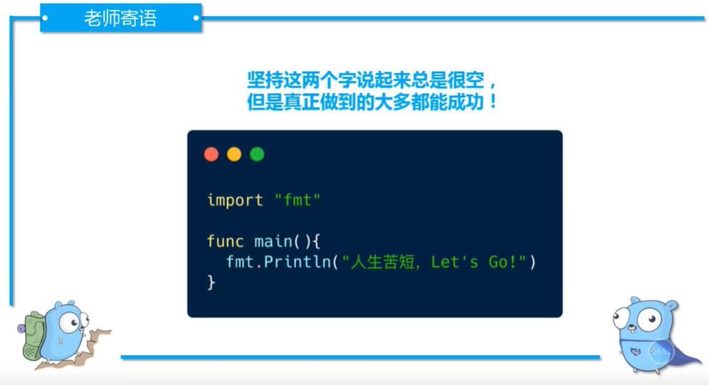

### 课程物料

[李文周讲师博客](https://www.liwenzhou.com/posts/Go/go_menu/)

课程笔记：markdown格式的笔记