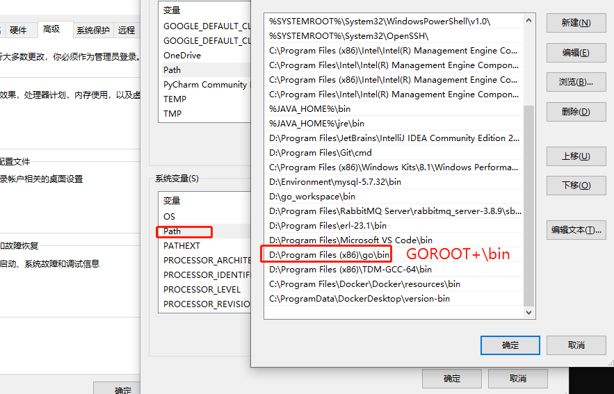

# Go语言开发环境搭建

>[视频来源](https://www.bilibili.com/video/BV1wy4y1r73r?p=3)

## 安装Go开发包

开发工具有`GoLand`、`vscode`等，由于`golang`涉及收费，虽然可以通过网上找到的激活码可以激活，在企业中为了避免不必要的麻烦，我们还是选择了开源版的`vscode`

**下载地址：**

Go官网下载地址：https://golang.org/dl/

Go官方镜像站（推荐）：https://golang.google.cn/dl/

**版本的选择：**

[下载地址](https://golang.google.cn/dl/)

`Windwos`平台和Mac平台推荐下载可执行文件版，Linux平台下载压缩文件版本。

安装目录一定要选择一个自己好记住的目录，因为这个目录到后面我们会再次了解到该目录，这个目录在环境变量中就是叫做：`GOROOT`， 我这里安装的是`go.15.6`。

## 配置GOPATH

先把刚才上面介绍的GOROOT，也就是我们go软件的安装目录忘记吧，这里我们讲一下`GOPATH`：

`GOPATH` 也是一个环境变量，用来表明我们写的go项目的存放路径，是我们开发的代码存放的本地计算机的位置。

`GOPATH`路径最好只设置一个，所有的项目代码都放到`GOPATH` 的 `src` 目录下。

Linux和Mac平台就参照上面配置环境变量的方式将自己的工作目录添加到环境变量中即可，Windows平台也是自己创建一个目录比如：`D:\go_workspace` 添加到环境变量中：GOPATH

**详细步骤：**

1. ​	在自己的电脑上新建一个目录：`D:\go_workspace` (存放我自己开发的Go语言代码)
2. ​    在环境变量里，新建一项： GOPATH:D:\go_workspace
3. ​    在`D:\go_workspace` 下新建三个文件夹，分别是`bin`、`src` 、`pkg`。
4. ​    把`D:\go_workspace\bin`这个目录添加到PATH这个环境变量的后面
   1. win7 是英文的 `;`分隔
   2. win10是单独一行添加
5. 你电脑上`GOPATH`应该是有默认值的，通常是`%USERPROFILE%/go`，我们把这一项删掉，自己按照上面步骤新建一个就可以了。

注意事项：配置好后一定要重新开一个`cmd`的窗口来查看配置是否生效，不要在老的`cmd`窗口上输入 `go env` 哦!,另外直接输入的go的前提是你go软件的安装目录+\bin 放在了系统了PATH环境变量中：

## Go项目目录结构介绍

## 安装vscode编辑器