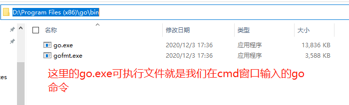

# Go语言开发环境搭建

>[视频来源](https://www.bilibili.com/video/BV1wy4y1r73r?p=3)


## 安装Go开发包

开发工具有`GoLand`、`vscode`等，由于`golang`涉及收费，虽然可以通过网上找到的激活码可以激活，在企业中为了避免不必要的麻烦，我们还是选择了开源版的`vscode`

**下载地址：**

Go官网下载地址：https://golang.org/dl/

Go官方镜像站（推荐）：https://golang.google.cn/dl/

**版本的选择：**

[下载地址](https://golang.google.cn/dl/)

`Windwos`平台和Mac平台推荐下载可执行文件版，Linux平台下载压缩文件版本。


安装目录一定要选择一个自己好记住的目录，因为这个目录到后面我们会再次了解到该目录，这个目录在环境变量中就是叫做：`GOROOT`， 我这里安装的是`go.15.6`。


## 配置GOPATH

先把刚才上面介绍的GOROOT，也就是我们go软件的安装目录忘记吧，这里我们讲一下`GOPATH`：

`GOPATH` 也是一个环境变量，用来表明我们写的go项目的存放路径，是我们开发的代码存放的本地计算机的位置。

`GOPATH`路径最好只设置一个，所有的项目代码都放到`GOPATH` 的 `src` 目录下。

Linux和Mac平台就参照上面配置环境变量的方式将自己的工作目录添加到环境变量中即可，Windows平台也是自己创建一个目录比如：`D:\go_workspace` 添加到环境变量中：GOPATH


**详细步骤：**

1. ​	在自己的电脑上新建一个目录：`D:\go_workspace` (存放我自己开发的Go语言代码)
2. ​    在环境变量里，新建一项： GOPATH:D:\go_workspace
3. ​    在`D:\go_workspace` 下新建三个文件夹，分别是`bin`、`src` 、`pkg`。
4. ​    把`D:\go_workspace\bin`这个目录添加到PATH这个环境变量的后面
   1. win7 是英文的 `;`分隔
   2. win10是单独一行添加
5. 你电脑上`GOPATH`应该是有默认值的，通常是`%USERPROFILE%/go`，我们把这一项删掉，自己按照上面步骤新建一个就可以了。

注意事项：配置好后一定要重新开一个`cmd`的窗口来查看配置是否生效，不要在老的`cmd`窗口上输入 `go env` 哦!,另外直接输入的go的前提是你go软件的安装目录+\bin 放在了系统了PATH环境变量中：





在Go 1.8 版本之前， `GOPATH`环境变量是默认是空的。从Go1.8版本开始，Go开发包在安装完成后会为`GOPATH`设置一个默认目录，参见下表。

**GOPATH在不同操作系统平台上的默认值**

| 平台    | GOPATH默认值     | 举例              |
| ------- | ---------------- | ----------------- |
| Windows | %USERPROFILE/go% | C:\User\用户名\go |
| Unix    | $HOME/go         | /home/用户名/go   |

同时，我们将`GOROOT`下的bin目录即`GOPATH`下的bi目录都添加到环境变量PATH中。


## Go项目目录结构

在进行Go语言开发的时候，我们的代码总是会保存在 `$GOPATH/src`目录下。在工程经过`go build`、`go install` 或 `go get` 等指令后，会将下载的第三分包源代码文件放在`$GOPATH/src` 目录下，产生的二进制可执行文件放在`$GOPATH/bin`目录下，生成的中间缓存文件会被保存在`$GOPATH/pkg` 目录下。

如果我们使用版本管理工具（Version Control System, VCS。例如常用的Git）来管理我们的项目代码时，我们只需要加`$GOPATH/src`  目录的源代码即可，`bin`和`pkg`目录的内容无需版本控制。


## 适合个人开发者

我们知道源代码都是存放在`GOPATH`的 `src` 目录下，那我们可以按照下图来组织我们的代码。


## 目前流行的项目结构

GO语言中也是通过包来组织代码文件，我们可以引用别人的包也可以发布自己的包，但是为了防止不同包的项目名冲突，我们通常使用`顶级域名`来作为包名的前缀，这样就不用担心项目名冲突的问题了。

因为不是每个个人开发者都拥有自己的顶级域名，所以目前流行的方式时使用个人`github`用户名来区别不同的包名。


举个例子：张三和李四都有一个名叫`studygo`的项目，那么这两个包的路径就是：

```go
import "github.com/zhangsan/studygo"
```

和

```go
import "github.com/lisi/studygo"
```

以后我们从github 上下载别人包的时候，如：

```go
go get github.com/gin-gonic/gin
```

那么在我自己本地，这个下载的包就会保存目录是这样的 `D:\go_workspace\src\github.com\gin-gonic\gin`。


## 适合企业开发者


## Go开发编辑器

Go采用的是UTF-8编码的文本文件存放源代码，理论上使用任何一款文本编辑器都可以做Go语言开发，这里推荐使用`VSCODE`和`GoLand`。`VS Code`是微软开源的编辑器，而`GoLand`是`jetbrains` 出品的付费IDE。

我们这里使用`VS Code`加插件作为go语言的开发工具。


## 安装`vscode`编辑器

`VS Code`全称 `Visual Studio Code`，是微软公司开源一款免费现代化轻量级代码编辑器，支持几乎所有主流的开发语言的语法高亮、智能代码补全、自定义热键、括号匹配、代码片段、代码对比Diff、GIT等特性，支持插件扩展，支持Win、Mac以及Linux平台。

虽然不如某些IDE功能强大，但是它添加GO扩展插件后已经足够胜任我们日常的Go开发工作。


### 下载和安装

`VS Code` 官方下载地址： https://code.visualszaaaaaaaatudio.com/Download

三大主流平台都支持，请根据自己的电脑平台选择对应的安装包。

我的是windows  10家庭版的


### 安装go扩展

现在我们要为我们的VS Code编辑器安装`Go`扩展插件，让它支持Go语言开发。


### 安装Go语言开发工具包

在做Go语言开发的时候为了使VS Code提供诸如代码提示、代码自动补全等功能。

在之前请先设置`GOPROXY` 变量，打开终端执行以下命令：

```go
go env -w GOPROXY=https://goproxy.cn,direct
```

Windows 平台按下`Ctrl+Shif+P`,Mac平台按`Command+Shift+P`,这个时候VS Code界面就会弹出一个输入框,如下图：


我们在这个输入框中输入`>go:install`，下面会自动搜索相关命令，我们选择`Go:Install/Update Tools`这个命令，按下图选中并回车执行该命令（或者使用鼠标点击该命令）


在弹出的窗口选中所有，并点击"确定"按钮，进行安装。


然后回弹出如下窗口，开始安装工具：


喝口水，等待所有工具都安装成功，如下图所示：


安装你安装失败，你一定要检查你的go环境变量  GOPROXY 和 GO111MODULE


### 配置VSCode开启自动保存

按下图依次点击，`文件-》首选项-》设置`


打开设置页面就能看到自动保存相关配置如下图，可以根据自己的喜好选择自动保存的方式：


### 配置代码片段快捷键

还是按`Ctrl/Command+Shift+P`,安下图输入`>snippets`，选择命令并执行：


然后在弹出的窗口点击选择`go`选项：


然后弹出如下页面：


大家可以简单看下上面的注释，介绍了主要用法：

```json
"这里放个名字"：{
    “prefix”: "这个是快捷键",
    "boby":"这里是按快捷键插入的代码片段",
    "description": "这里放提示信息的描述"
}
```

其中`$0`表示最终光标提留的位置。举个例子，我这里创建了两个快捷方式，一个是输入`pln`就会在编辑器中插入`fmt.Println()`代码；输入`plf`就会在编辑器中插入`fmt.Printf("")`代码。

```go
{
    "println":{
        "prefix": "pln",
        "body":"fmt.Println($0)",
        "description": "println"
    },
    "printf":{
        "prefix": "plf",
        "body": "fmt.Printf(\"$0\")",
        "description": "printf"
    }
}

```

把上面的代码，按下图方式粘贴到配置文件中，保存并关闭配置文件即可。


添加如上配置后，保存。我们打开一个go文件，测试以下结果：

