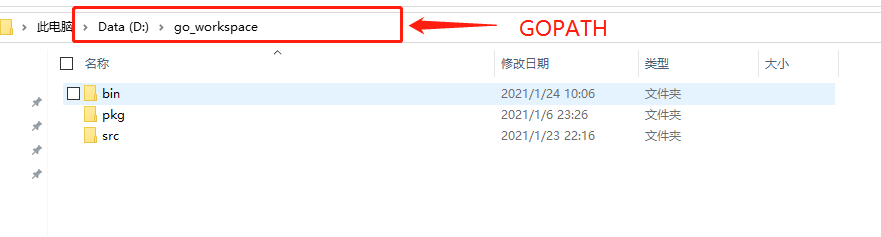
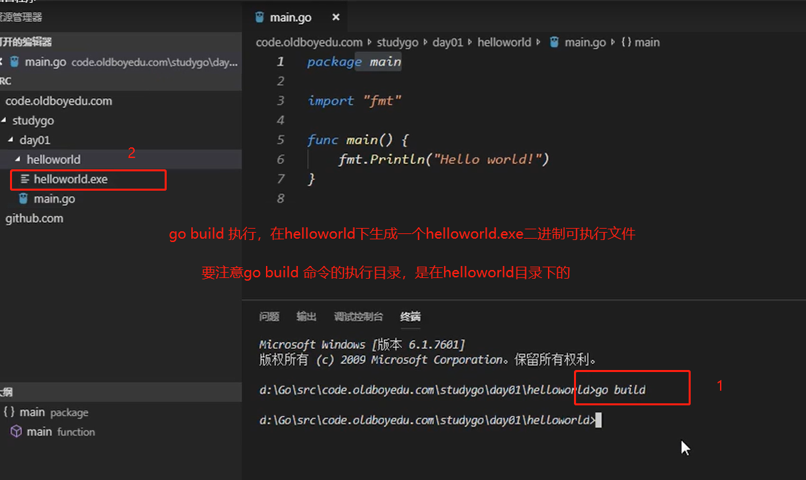
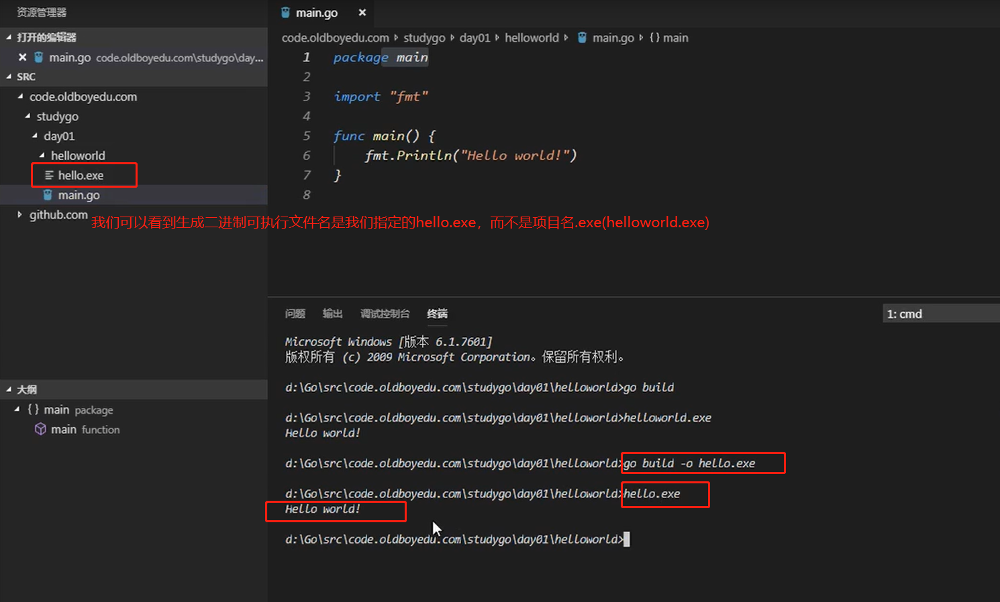

# 第一个Go程序及变量

## Hello World

现在我们来创建第一个Go项目--`hello`。在我们的`GOPATH`下 `src`目录中创建hello目录。




在该目录中创建一个`main.go`文件：

```go
package main  // 声明 main 包， 表明当前是一个可执行程序

import "fmt"  // 导入内置 fmt 包

func main() {  // main函数，是程序执行的入口
    fmt.Println("Hello World!")   // 在终端打印 Hello World!
}
```

## go build

使用`go build`

1. 在项目目录下执行`go build`
2. 在其他路径下执行`go build`，需要在后面加上项目的路径（项目路径从`GOPATH/src`后开始写起,编译之后的可执行文件就在当前目录中）
3. 如果不想使用默认的二进制可执行文件名（默认情况下可执行文件名为项目名.exe），可以使用`-o` 参数指定生成的可执行文件名






## go run

向执行脚本文件一样执行Go代码


## go install

`go install` 分两步：

1. 先编译得到一个可执行文件
2. 将可执行文件拷贝到`GOPATH/bin`

`go install`表示安装的意思：它先编译源代码得到可执行文件，然后将可执行文件移动到`GOPATH`的bin目录下。因为我们的环境变量中配置了`GOPATH`下的bin目录，所以我们就可以在任意地方直接执行可执行文件了。


## 跨平台编译

默认我们 `go build` 的可执行文件都是当前操作系统可执行的文件。

如果我想在windows下编译一个`linux`下可执行文件，那需要怎么做呢?

只需要指定目标操作系统的平台和处理器架构即可：

```go
SET CGO_ENABLED=0 // 禁用CGO
SET GOOS=linux // 目标平台是linux
SET GOARCH=amd64  //目标处理器架构是amd64
```

然后再执行`go build`命令，得到的就是能够在Linux平台运行的可执行文件了。

Mac 下编译 Linux 和 Windows 平台64位可执行程序：

```go
CGO_ENABLED=0 GOOS=linux GOARCH=amd64 go build
CGO_ENABLED=0 GOOS=windows GOARCH=amd64 go build
```

Linux  下编译 Mac 和 Windows 平台64位可执行程序：

```go
CGO_ENABLED=0 GOOS=darwin GOARCH=amd64 go build
CGO_ENABLED=0 GOOS=windows GOARCH=amd64 go build
```

Windows 下编译Mac平台64位可执行程序：

```go
SET CGO_ENABLED=0
SET GOOS=darwin
SET GOARCH=amd64
go build
```


## 变量

### 变量声明

### 变量赋值

### 常量和iota

### 整型

### 浮点型负数和布尔值

 