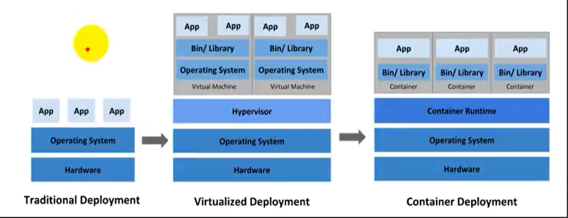
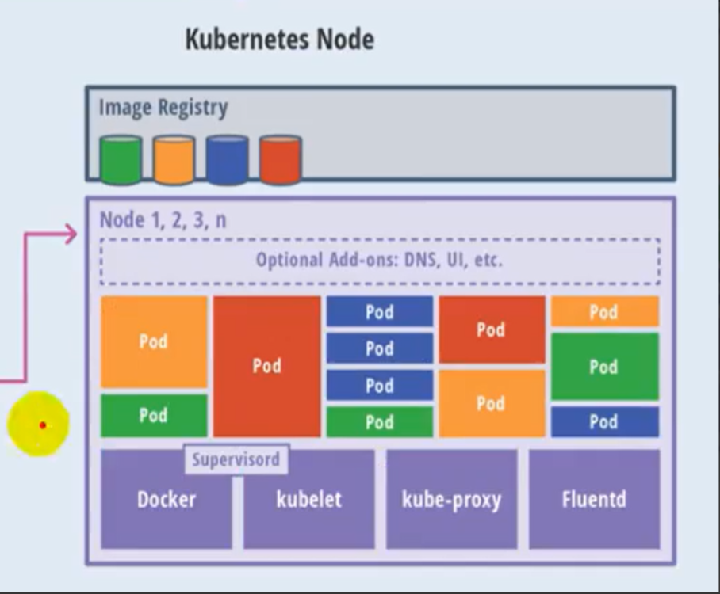

# Kubernetes简介

## 来源

bilibili尚硅谷K8S视频：[https://www.bilibili.com/video/BV1GT4y1A756](https://www.bilibili.com/video/BV1GT4y1A756)

官网：[https://kubernetes.io/](https://kubernetes.io/)

中文官网：[https://kubernetes.io/zh/#](https://kubernetes.io/zh/#)

中文社区：[https://www.kubernetes.org.cn/](https://www.kubernetes.org.cn/)

## 介绍

K8S是kubernetes的简称，K是kubernetes单词的首字母的大写，8代表 ubernete 8个字母，S就是kubernetes尾字母的大写， 除了一些知名的大的互联网公司在使用K8S之外，很多中小公司也在拥抱K8S，可以说容器化技术是大势所趋。

## 前置知识

- **LInux 操作系统**
- **Docker**

## 课程涉及知识点

1. 第一部分：k8s概念和架构
2. 第二部分：从零搭建k8s集群
   1. 基于客户端工具kubeadm
   2. 基于二进制包方式   （熟悉每个组件，更好理解k8s的架构）
3. 第三部分：k8s核心概念
   1. Pod：k8s集群管理的最小单元，是所有业务类型基础
   2. Controller：Deployment（无状态）、StatefulSet（有状态）、DaemonSet（守护式进程）、Job（一次任务）、CronJob（定时任务）
   3. Service：集群内部对外暴露服务
   4. Ingress：
   5. RBAC权限：权限控制，安全机制
   6. Helm：
   7. 持久化存储：
4. 第四部分：搭建集群监控平台系统
5. 第五部分：从零搭建高可用k8s集群
6. 第六部分：在集群环境中部署项目

## K8S概念和特性

### 业务部署的发展历程

在工作中我们也经历这样的部署历程

>传统部署 --> 虚拟化部署时代 --> 容器部署时代

- **传统部署时代**：早期，组织在物理服务器上运行应用程序。无法为物理服务器中的应用程序定义资源边界，这会导致资源分配问题。例如，如果在物理服务器上运行多个应用程序，则可能会出现一个应用程序占用大部分资源的情况，结果可能导致其他应用程序的性能下降。一种解决方案是在不同的物理服务器上运行每个应用程序，但是由于资源利用不足而无法扩展，并且组织维护许多物理服务器的成本很高。
- **虚拟化部署时代**：作为解决方案，引入了虚拟化功能，它允许您在单个物理服务器的CPU上运行多个虚拟机（VM）。虚拟化功能允许应用程序在VM之间隔离，并提供安全级别，因为一个应用程序的信息不能被另一个应用程序自由地访问。因为虚拟化可以轻松地添加或更新应用程序、降低硬件成本等等，所以虚拟化可以更好地利用物理服务器中的资源，并可以实现更好的可伸缩性。每个VM是一台完整的计算机，在虚拟化硬件之上运行所有组件，包括其自己的操作系统。
- **容器部署时代**： 容器类似于VM，但是它们具有轻量级的隔离属性，可以在应用程序之间共享操作系统（OS），因此，容器被认为是轻量级的。容器与VM类似，具有自己的文件系统、CPU、内存、进程空间等。由于它们与基础架构分离，因此可以跨云和OS分发及进行移植。

容器因具有许多优势而变得流行起来。下面列出容器一些好处：

- 敏捷应用程序的创建和部署：与使用VM镜像相比，提高了容器镜像创建的简便性和效率。
- 持续开发、集成和部署：通过简单的回滚（由于镜像不可变性），提供可靠且频繁的容器镜像构建和部署。
- 关注开发与运维的分离：在构建/时而不是在部署时创建应用程序容器镜像，将应用程序与基础架构分离。
- 可观察性：不仅可以显示操作系统级别的信息和指标，还可以显示应用程序的运行状况和其他指标信号。
- 跨开发、测试和生产的环境一致性：在便携式计算机上与在云上相同地运行。
- 云和操作系统的分发的可移植性：可在Ubuntu、RHEL、CoreOS、裸金属、Google Kubernetes Engine和其它任何其它地方运行。
- 以应用程序为中心的管理：提高抽象级别，从在虚拟硬件上运行OS到使用逻辑资源在OS上运行应用程序。
- 松散耦合、分布式、弹性、解决的微服务：应用程序被分解成较小的独立部分，并且可以动态部署和管理-而不是在一台大型单机器上运行。
- 资源隔离：可预测应用程序性能。

### 1、kubernetes基本介绍

​		kubernetes，简称K8S，是用 8 代替 8 个连续的字符 "ubernete" 而成的缩写，是一个开源的，用于管理云平台中多个主机上的容器化的应用，Kubernetes 的目标是让部署容器化的应用简单并且高效（powerful），kubernetes提供了应用部署，规划，更新，维护的一种机制。

​		传统的应用部署方式是通过插件或脚本来安装应用。这样做的缺点是应用的运行、配置、管理、所有生存周期将于操作系统绑定。这样做并不利于应用的升级更新/回滚等操作，当然也可以通过创建虚拟机的方式来实现某些功能，但是虚拟机非常重，并不利于可移植性。

​		新的方式是通过部署容器方式实现，每个容器之间互相隔离，每个容器有自己的文件系统，容器之间进程不会相互影响，能区分计算资源。相对于虚拟机，容器能快速部署，由于容器与底层设施、机器文件系统解耦，所以它能不同云、不同版本的操作系统进行迁移。

​		容器占用资源少、部署快，每个应用可以被打包成一个容器镜像，每个应用与容器间成一对一关系也使容器有更大优势，使用容器可以在 build 或 release 阶段，为应用创建容器，因为每个应用不需要与其余的应用堆栈组合，也不依赖于生产环境基础结构，这使得从研发到测试、生产能提供一致环境。类似地，容器比虚拟机轻量、更”透明“，这更便于监控和管理。

​		Kubernetes 是 Google 开源的一个容器编排引擎，它支持自动化部署、大规模可伸缩、应用容器化管理。在生产环境中部署一个应用程序时，通常要部署该应用的多个实例以便对应用请求进行负载均衡。

​		在 Kubernetes 中，我们可以创建多个容器，每个容器里面运行一个应用实例，然后通过内置的负载均衡策略，实现对这一组应用实例的管理、发现、访问、而这些细节都不需要运维人员去进行复杂手工配置和处理。

### 2、kubernetes 功能

**概述**

​		Kubernetes 是一个轻便的和可扩展的开源平台，用于管理容器化应用和服务。通过Kubernetes 能够进行应用的自动化部署和扩缩容。在 Kubernetes 中，会将组成应用的容器组合成一个逻辑单元以便更易管理和发现。Kubernetes 积累了作为 Google 生产环境 Brog 系统运行工作负载15年的经验。并吸收来自于社区的最佳想法和实践。

**k8s功能**

自动装箱

- 基于容器对应用运行环境的资源配置要求自动部署应用容器

自我修复（自愈能力）

- 当容器失败时，会对容器进行重启
- 当所部署的 Node 节点有问题时，会对容器进行重新部署和重新调度
- 当容器未通过健康检查时，会关闭此容器知道容器正常运行时，才会对外提供服务

水平扩展

- 通过简单的命令、用户 UI 界面或基于 CPU 等资源使用情况，对应用容器进行规模扩大或规模剪裁

服务发现

- 用户不需要使用额外的服务发现机制，就能够基于 Kubernetes 自身能力实现服务发现和负载均衡

滚动更新

- 可以根据应用的变化，对应用容器运行的应用，进行一次性或批量式更新

版本回退

- 可以根据应用部署情况，对应用容器运行的业务应用，进行历史版本即时回退

密钥和配置管理

- 在不需要重新构建镜像的情况下，可以部署和更新密钥和应用配置，类似热部署。

存储编排

- 自动实现存储系统挂载及应用，特别对有状态应用实现数据持久化非常重要。存储系统可以来自于本地目录、网络存储（NFS、Gluster、Ceph等）、公共云存储服务。

批处理

- 提供一次性任务，定时任务：满足批量数据处理和分析的场景。

### 3、k8s集群架构组件

- 组件架构图

​		

架构分为Master节点和Work节点

Master节点内部的组件架构：

* API Server : 	集群统一入口，以RESTful方式，交给etcd存储
* Scheduler:      节点调度，利用一系列的算法来选择Work节点部署应用
* Controller Manager:    去处理集群中一些常规的后台任务，一个资源对应一个控制器。
* etcd:    存储系统，用于保存集群相关的数据

​	Work节点内部的组件架构：

- ​	kubelet:	相当于master派到node节点的代表，管理本机容器
- ​    kube-proxy:    提供网络代理，负载均衡等操作								

​					

​							

​	

