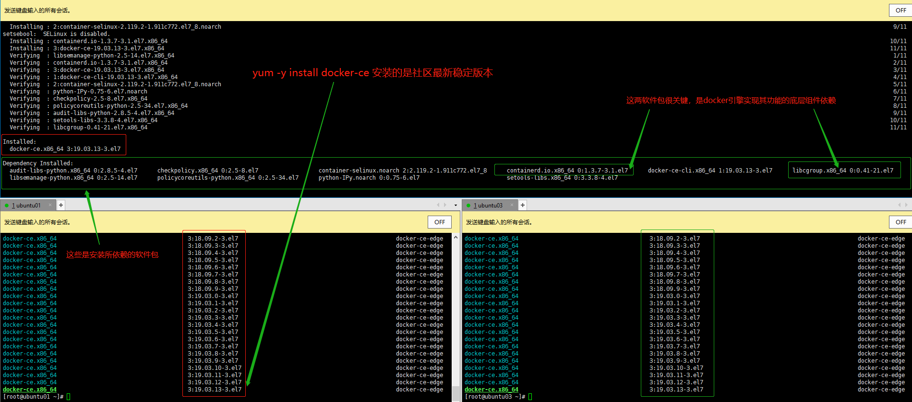
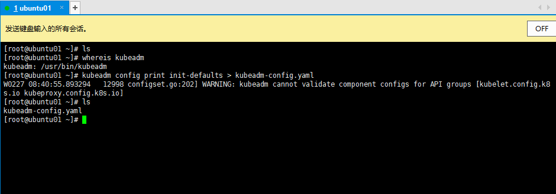
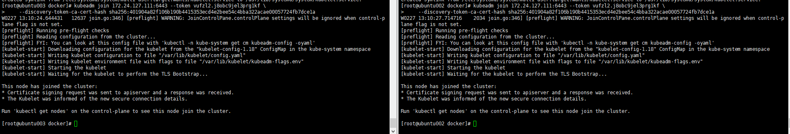
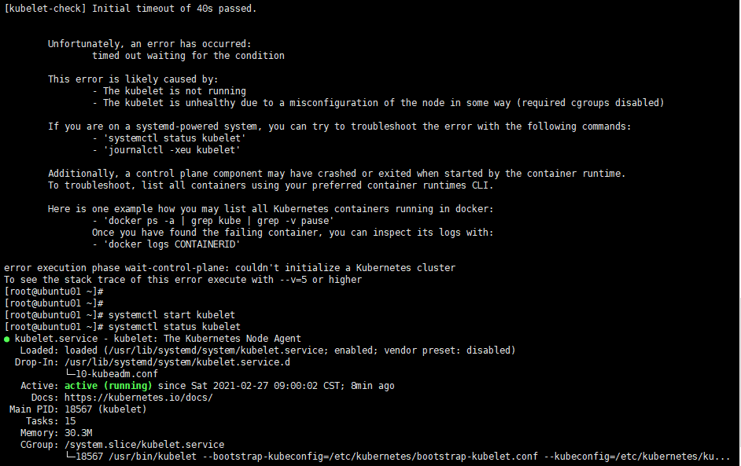
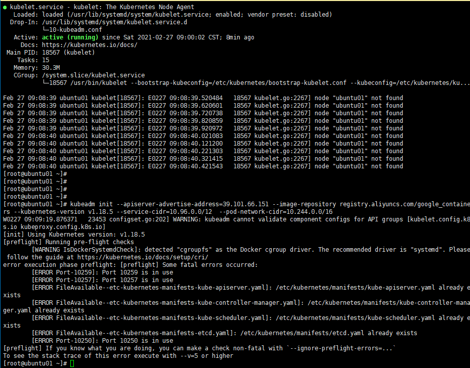

# 使用kubeadm方式搭建K8S集群

kubeadm 是官方社区推出的一个用于快速部署kubernetes 集群的工具。

这个工具能通过两条指令完成一个kubernetes 集群的部署：

```shell
# 创建一个 Master 节点
kubeadm init

# 将一个 Node 节点加入到当前集群中
kubeadm join <Master 节点的IP和端口>
```

## kubeadm方式搭建K8S集群

使用kubeadm 方式搭建K8S集群主要分为以下几步：

- 准备三台虚拟机或者三台阿里云的ECS， 同时选择安装操作系统CentOS7.x
- 对三个安装操作系统之后的机器进行初始化操作
- 在三个节点安装 docker、kubelet、kubeadm、kubectl
- 在master节点执行kubeadm init 命令初始化
- 在node节点上执行 kubeadm join命令，把node节点添加到集群中
- 配置CNI网络插件，用于节点之间的联通（失败了可以多试几次，主要在于拉取镜像的过程失败，因为镜像在国外，我们可以把镜像先通过特殊渠道下载下来，导入服务器中，可以加快部署速度）
- 通过部署一个nginx在集群中测试，看看外网是否能正常访问，我这里会部署一个golang的小应用来测试集群的可用性


## 安装要求

在开始之前，部署kubernetes 集群机器需要满足以下几个条件：

- 一台或多台机器，操作系统 CentOS7.x-86_x64
- 硬件配置：2GB或更多RAM，2个CPU或更多CPU，硬盘30GB或更多【注意master需要两核】
- 可以访问外网，需要拉取镜像，如果服务器不能上网，需要提前下载镜像并导入节点
- 禁止swap分区

## 准备环境-三台阿里云机器


**部署规划：**

| 主机名    | IP             | 角色   |
| --------- | -------------- | ------ |
| ubuntu001 | 172.24.127.111 | master |
| ubuntu002 | 172.29.68.239  | node1  |
| ubuntu003 | 172.24.127.112 | node2  |

然后开始执行下面的命令,下面安装我都是以root用户身份来执行命令的：

```shell
# master、node1、node2 上都执行关闭防火墙和设置开机禁用防火墙的命令
systemctl stop    firewalld
systemctl disable firewalld

# master、node1、node2 都关闭seLinux
# 永久关闭
sed -i 's|Selinux=enforcing|Selinux=disabled|g'  /etc/selinux/config

# 关闭swap
# 永久关闭(我这里申请的阿里云机器没有swap分区)
sed -ri 's/.*swap.*/#&/'  /etc/fstab  

# 根据规划设置主机名 【master 节点上操作】
hostnamectl set-hostname ubuntu01
# 根据规划设置主机名 【node1 节点操作】
hostnamectl set-hostname ubuntu02
# 根据规划设置主机名 【node2 节点操作】
hostnamectl set-hostname ubuntu03

# 在master、node01、node02 添加hosts
cat >> /etc/hosts << EOF
172.24.127.111 ubuntu001
172.29.68.239  ubuntu002
172.24.127.112 ubuntu003
EOF

# 将桥接的IPv4流量传递到iptables 的链
cat > /etc/sysctl.d/k8s.conf << EOF
net.bridge.bridge-nf-call-ip6tables = 1
net.bridge.bridge-nf-call-iptables = 1
EOF

# 生效
sysctl --system

# 时间同步
yum install ntpdate -y
ntpdate time.windows.com

```

**在这里添加一个图哈：**


## 安装Docker

所有的节点都要安装Docker，因为kubeadm方式安装k8s，master节点的API Server、Scheduler、Controller-Manager等组件是以Pod的方式启动的。Work节点就不用说了，因为要部署工作负载，更需要Docker引擎了。

首先配置Docker的国内的阿里docker源仓库地址，注意每台机器都要执行

```shell
cat >/etc/yum.repos.d/docker.repo <<EOF
[docker-ce-edge]
name=Docker CE Edge - \$basearch
baseurl=https://mirrors.aliyun.com/docker-ce/linux/centos/7/\$basearch/edge
enabled=1
gpgcheck=1
gpgkey=https://mirrors.aliyun.com/docker-ce/linux/centos/gpg
EOF
# 或者直接执行下面的一条命令,也是按照docker源的仓库地址，和上面的cat命令效果是一样的
sudo yum install -y yum-utils device-mapper-persistent-data lvm2
sudo yum-config-manager --add-repo http://mirrors.aliyun.com/docker-ce/linux/centos/docker-ce.repo
```

然后yum方式安装最新社区版docker-ce，再次注意每台机器都要执行

```shell
# yum安装社区最新版
yum -y install docker-ce

# 设置docker的开机自启动
systemctl enable docker

# 启动docker
systemctl start docker

# 查看docker版本
docker --version  
```

或者安装指定版本的docker-ce

```shell
# 列出镜像仓库地址可用的docker-ce的所有版本
yum list docker-ce --showduplicates

# 列出所有的可用的docker-ce的版本，选择你需要的版本，镜像安装，比如：19.03.6-3.e17 版本
yum install -y install docker-ce-19.03.6-3.el7

# 设置docker的开机自启动
systemctl enable docker

# 启动docker
systemctl start docker

# 查看docker版本
docker --version  
```


**在这里补一个安装docker的图哈：**




在部署k8s的过程中，用到的各个组件都是以镜像容器的方式来部署的，以及以后在k8s上工作负载也都是以镜像容器的方式来部署，所以我们需要配置一个镜像源仓库加速地址，这里我采用阿里云的给个人用户配置专属镜像加速器地址：

```shell
# 如果你部署好docker，没有/etc/docker这个目录，需要自己手动创建 make /etc/docker,同时修改docker的cgroupdirver为systemd
cat >> /etc/docker/daemon.json << EOF
{
  "exec-opts": ["native.cgroupdriver=systemd"],
  "registry-mirrors": ["https://95tfc660.mirror.aliyuncs.com"]
}
EOF
```

然后重启docker

```shell
systemctl daemon-reload
systemctl restart docker
```

## 添加kubernetes软件源

```shell
# 下面的命令需要在master、node1、node2上都执行
cat > /etc/yum.repos.d/kubernetes.repo << EOF
[kubernetes]
name=Kubernetes
baseurl=https://mirrors.aliyun.com/kubernetes/yum/repos/kubernetes-el7-x86_64
enabled=1
gpgcheck=0
repo_gpgcheck=0
gpgkey=https://mirrors.aliyun.com/kubernetes/yum/doc/yum-key.gpg https://mirrors.aliyun.com/kubernetes/yum/doc/rpm-package-key.gpg
EOF
```

安装kubeadm、kubelet、kubectl

由于版本更新频繁，这里指定版本号部署：

```shell
# 安装kubelet、kubeadm、kubectl，同时指定版本，master、node1、node2 三台机器都执行
yum install -y kubelet-1.18.5 kubeadm-1.18.5 kubectl-1.18.5
# master、node1、node2 启用kubelet.service
systemctl enable kubelet.service
```


## 部署kubernetes Master 【master节点】

在 ubuntu01 (39.101.66.151) 机器上执行 kubeadm init 的集群master节点的初始化

```shell
[root@ubuntu001 docker]# kubeadm init --apiserver-advertise-address=172.24.127.111 --image-repository registry.aliyuncs.com/google_containers --kubernetes-version v1.18.5 --service-cidr=10.96.0.0/12  --pod-network-cidr=10.244.0.0/16
W0227 12:57:48.084891    1953 configset.go:202] WARNING: kubeadm cannot validate component configs for API groups [kubelet.config.k8s.io kubeproxy.config.k8s.io]
[init] Using Kubernetes version: v1.18.5
[preflight] Running pre-flight checks
	[WARNING Service-Kubelet]: kubelet service is not enabled, please run 'systemctl enable kubelet.service'
[preflight] Pulling images required for setting up a Kubernetes cluster
[preflight] This might take a minute or two, depending on the speed of your internet connection
[preflight] You can also perform this action in beforehand using 'kubeadm config images pull'
^C
[root@ubuntu001 docker]# systemctl enable kubelet.service
Created symlink from /etc/systemd/system/multi-user.target.wants/kubelet.service to /usr/lib/systemd/system/kubelet.service.
[root@ubuntu001 docker]# 
[root@ubuntu001 docker]# 
[root@ubuntu001 docker]# kubeadm init --apiserver-advertise-address=172.24.127.111 --image-repository registry.aliyuncs.com/google_containers --kubernetes-version v1.18.5 --service-cidr=10.96.0.0/12  --pod-network-cidr=10.244.0.0/16
W0227 12:59:03.016352    2123 configset.go:202] WARNING: kubeadm cannot validate component configs for API groups [kubelet.config.k8s.io kubeproxy.config.k8s.io]
[init] Using Kubernetes version: v1.18.5
[preflight] Running pre-flight checks
[preflight] Pulling images required for setting up a Kubernetes cluster
[preflight] This might take a minute or two, depending on the speed of your internet connection
[preflight] You can also perform this action in beforehand using 'kubeadm config images pull'
[kubelet-start] Writing kubelet environment file with flags to file "/var/lib/kubelet/kubeadm-flags.env"
[kubelet-start] Writing kubelet configuration to file "/var/lib/kubelet/config.yaml"
[kubelet-start] Starting the kubelet
[certs] Using certificateDir folder "/etc/kubernetes/pki"
[certs] Generating "ca" certificate and key
[certs] Generating "apiserver" certificate and key
[certs] apiserver serving cert is signed for DNS names [ubuntu001 kubernetes kubernetes.default kubernetes.default.svc kubernetes.default.svc.cluster.local] and IPs [10.96.0.1 172.24.127.111]
[certs] Generating "apiserver-kubelet-client" certificate and key
[certs] Generating "front-proxy-ca" certificate and key
[certs] Generating "front-proxy-client" certificate and key
[certs] Generating "etcd/ca" certificate and key
[certs] Generating "etcd/server" certificate and key
[certs] etcd/server serving cert is signed for DNS names [ubuntu001 localhost] and IPs [172.24.127.111 127.0.0.1 ::1]
[certs] Generating "etcd/peer" certificate and key
[certs] etcd/peer serving cert is signed for DNS names [ubuntu001 localhost] and IPs [172.24.127.111 127.0.0.1 ::1]
[certs] Generating "etcd/healthcheck-client" certificate and key
[certs] Generating "apiserver-etcd-client" certificate and key
[certs] Generating "sa" key and public key
[kubeconfig] Using kubeconfig folder "/etc/kubernetes"
[kubeconfig] Writing "admin.conf" kubeconfig file
[kubeconfig] Writing "kubelet.conf" kubeconfig file
[kubeconfig] Writing "controller-manager.conf" kubeconfig file
[kubeconfig] Writing "scheduler.conf" kubeconfig file
[control-plane] Using manifest folder "/etc/kubernetes/manifests"
[control-plane] Creating static Pod manifest for "kube-apiserver"
[control-plane] Creating static Pod manifest for "kube-controller-manager"
W0227 12:59:45.469471    2123 manifests.go:225] the default kube-apiserver authorization-mode is "Node,RBAC"; using "Node,RBAC"
[control-plane] Creating static Pod manifest for "kube-scheduler"
W0227 12:59:45.470310    2123 manifests.go:225] the default kube-apiserver authorization-mode is "Node,RBAC"; using "Node,RBAC"
[etcd] Creating static Pod manifest for local etcd in "/etc/kubernetes/manifests"
[wait-control-plane] Waiting for the kubelet to boot up the control plane as static Pods from directory "/etc/kubernetes/manifests". This can take up to 4m0s
[apiclient] All control plane components are healthy after 21.501889 seconds
[upload-config] Storing the configuration used in ConfigMap "kubeadm-config" in the "kube-system" Namespace
[kubelet] Creating a ConfigMap "kubelet-config-1.18" in namespace kube-system with the configuration for the kubelets in the cluster
[upload-certs] Skipping phase. Please see --upload-certs
[mark-control-plane] Marking the node ubuntu001 as control-plane by adding the label "node-role.kubernetes.io/master=''"
[mark-control-plane] Marking the node ubuntu001 as control-plane by adding the taints [node-role.kubernetes.io/master:NoSchedule]
[bootstrap-token] Using token: vufzl2.j8obc9jel3prg1kf
[bootstrap-token] Configuring bootstrap tokens, cluster-info ConfigMap, RBAC Roles
[bootstrap-token] configured RBAC rules to allow Node Bootstrap tokens to get nodes
[bootstrap-token] configured RBAC rules to allow Node Bootstrap tokens to post CSRs in order for nodes to get long term certificate credentials
[bootstrap-token] configured RBAC rules to allow the csrapprover controller automatically approve CSRs from a Node Bootstrap Token
[bootstrap-token] configured RBAC rules to allow certificate rotation for all node client certificates in the cluster
[bootstrap-token] Creating the "cluster-info" ConfigMap in the "kube-public" namespace
[kubelet-finalize] Updating "/etc/kubernetes/kubelet.conf" to point to a rotatable kubelet client certificate and key
[addons] Applied essential addon: CoreDNS
[addons] Applied essential addon: kube-proxy

Your Kubernetes control-plane has initialized successfully!

To start using your cluster, you need to run the following as a regular user:

  mkdir -p $HOME/.kube
  sudo cp -i /etc/kubernetes/admin.conf $HOME/.kube/config
  sudo chown $(id -u):$(id -g) $HOME/.kube/config

You should now deploy a pod network to the cluster.
Run "kubectl apply -f [podnetwork].yaml" with one of the options listed at:
  https://kubernetes.io/docs/concepts/cluster-administration/addons/

Then you can join any number of worker nodes by running the following on each as root:

kubeadm join 172.24.127.111:6443 --token vufzl2.j8obc9jel3prg1kf \
    --discovery-token-ca-cert-hash sha256:401904a82f106b190b4415353ecd4e2bee54c4bba322acae00057724fb7dce1a 
```

关于上面这一步的替代方案，我们也可以在先生成一个初始化的yaml文件，对其进行镜像仓库地址的修改等，然后用yaml文件来镜像初始化

```shell
kubeadm config print init-defaults > kubeadm-config.yaml
# 会在当前目录下生成 kubeadm-config.yaml 的文件
```



下面我们看一下这个 kubeadm-config.yaml 文件的内容

```yaml
apiVersion: kubeadm.k8s.io/v1beta2
bootstrapTokens:
- groups:
  - system:bootstrappers:kubeadm:default-node-token
  token: abcdef.0123456789abcdef
  ttl: 24h0m0s
  usages:
  - signing
  - authentication
kind: InitConfiguration
localAPIEndpoint:
  advertiseAddress: 1.2.3.4          # 这里需要修改为ubuntu01 的公网IP 39.101.66.151
  bindPort: 6443
nodeRegistration:
  criSocket: /var/run/dockershim.sock
  name: ubuntu01
  taints:
  - effect: NoSchedule
    key: node-role.kubernetes.io/master
---
apiServer:
  timeoutForControlPlane: 4m0s
apiVersion: kubeadm.k8s.io/v1beta2
certificatesDir: /etc/kubernetes/pki
clusterName: kubernetes
controllerManager: {}
dns:
  type: CoreDNS
etcd:
  local:
    dataDir: /var/lib/etcd
imageRepository: k8s.gcr.io    # 需要修改为阿里云的镜像仓库地址 registry.aliyuncs.com/google_containers
kind: ClusterConfiguration
kubernetesVersion: v1.18.0     # 需要修改我们部署的版本 v1.18.5
networking:
  dnsDomain: cluster.local
  podSubnet: "10.244.0.0/16" # 新增pod的网段，默认生成文件中没有
  serviceSubnet: 10.96.0.0/12  # service对象的子网，k8s中一种资源对象
scheduler: {}
```


由于默认拉取镜像地址 `k8s.gcr.io`国内无法访问，这里指定阿里云镜像仓库地址，【执行上述命令需要一些时间，因为需要在后台拉取各个组件的镜像】，我们可以使用 `kubeadm config images list --kubernetes-version=1.18.5 `  命令查看需要安装哪些镜像:

```shell
root@k8smaster:~/k8s# kubeadm config images list --kubernetes-version=1.18.5
W1120 17:06:53.904807   14527 configset.go:202] WARNING: kubeadm cannot validate component configs for API groups [kubelet.config.k8s.io kubeproxy.config.k8s.io]
k8s.gcr.io/kube-apiserver:v1.18.5
k8s.gcr.io/kube-controller-manager:v1.18.5
k8s.gcr.io/kube-scheduler:v1.18.5
k8s.gcr.io/kube-proxy:v1.18.5
k8s.gcr.io/pause:3.2
k8s.gcr.io/etcd:3.4.3-0
k8s.gcr.io/coredns:1.6.7
# 由于修改了拉取阿里云的镜像，所以拉取的镜像仓库地址是registry.aliyuncs.com/google_containers/
# 所以上面在执行kubeadm init ... 初始化之前我们可以在master节点提前下载以下镜像
docker pull registry.aliyuncs.com/google_containers/kube-apiserver:v1.18.5
docker pull registry.aliyuncs.com/google_containers/kube-controller-manager:v1.18.5
docker pull registry.aliyuncs.com/google_containers/kube-proxy:v1.18.5
docker pull registry.aliyuncs.com/google_containers/pause:3.2
docker pull registry.aliyuncs.com/google_containers/etcd:3.4.3-0
docker pull registry.aliyuncs.com/google_containers/coredns:1.6.7

# node节点需要下载以下镜像
docker pull registry.aliyuncs.com/google_containers/kube-proxy:v1.18.5
docker pull registry.aliyuncs.com/google_containers/pause:3.2
# 到这里我们就剩跨节点的扁平化的网络插件没有安装，我们采用的是flannel，由于我们直接拉取的是flannel的yaml文件里的镜像是一个国内网络不能访问的地址，所以我们需要对flannel yaml中的镜像需要提前下载好，这个网络插件需要以DaemonSet的方式部署载每一个节点上。
```

当我们出现下面的输出时，说明kubernetes 的初始化已经完成

```shell
............
............
............
[kubelet-finalize] Updating "/etc/kubernetes/kubelet.conf" to point to a rotatable kubelet client certificate and key
[addons] Applied essential addon: CoreDNS
[addons] Applied essential addon: kube-proxy

Your Kubernetes control-plane has initialized successfully!

To start using your cluster, you need to run the following as a regular user:

  mkdir -p $HOME/.kube
  sudo cp -i /etc/kubernetes/admin.conf $HOME/.kube/config
  sudo chown $(id -u):$(id -g) $HOME/.kube/config

You should now deploy a pod network to the cluster.
Run "kubectl apply -f [podnetwork].yaml" with one of the options listed at:
  https://kubernetes.io/docs/concepts/cluster-administration/addons/

Then you can join any number of worker nodes by running the following on each as root:

kubeadm join 172.24.127.111:6443 --token vufzl2.j8obc9jel3prg1kf \
    --discovery-token-ca-cert-hash sha256:401904a82f106b190b4415353ecd4e2bee54c4bba322acae00057724fb7dce1a 
```

如果你是普通用户还是root用户，都执行下面命令【master 节点操作】

```shell
[root@ubuntu001 docker]# mkdir -p $HOME/.kube
[root@ubuntu001 docker]# sudo cp -i /etc/kubernetes/admin.conf $HOME/.kube/config
[root@ubuntu001 docker]# sudo chown $(id -u):$(id -g) $HOME/.kube/config
```

执行完成后，我们使用下面命令，查看我们正在运行的节点

```shell
[root@ubuntu001 ~]# kubectl get nodes
NAME        STATUS     ROLES    AGE     VERSION
ubuntu001   NotReady   master   7m50s   v1.18.5
```

能够看到，目前有一个master节点已经运行了，但是还处于未准备状态


下面我们还需要在Node节点执行其他的命令，将node1和node2加入到我们master节点上来。

## 加入kubernetes Node 【Slave节点】

下面我们需要到 k8snode1 和 k8snode2 服务器，执行下面的代码向集群添加新节点

执行在kubeadm init 输出的kubeadm join命令：

> 注意，以下的命令是在master 初始化完成后，每个人都是不同的，需要复制自己生成的

```shell
kubeadm join 172.24.127.111:6443 --token vufzl2.j8obc9jel3prg1kf \
>     --discovery-token-ca-cert-hash sha256:401904a82f106b190b4415353ecd4e2bee54c4bba322acae00057724fb7dce1a
```



默认token有效期为24小时，当过期之后，该token就不可用了。这时就需要重新创建token，操作如下：

```shell
kubeadm token create --print-join-command
```

当我们把另外两个node加入进来后，我们就可以去 k8smaster 上执行 kubectl get nodes 命令了，但是所有节点的状态都是 NotReady ，因为还没安装网络插件

```shell
[root@ubuntu001 ~]# kubectl get nodes
NAME        STATUS     ROLES    AGE   VERSION
ubuntu001   NotReady   master   11m   v1.18.5
ubuntu002   NotReady   <none>   66s   v1.18.5
ubuntu003   NotReady   <none>   69s   v1.18.5

[root@ubuntu001 ~]# kubectl get cs
NAME                 STATUS    MESSAGE             ERROR
controller-manager   Healthy   ok                  
scheduler            Healthy   ok                  
etcd-0               Healthy   {"health":"true"}   
```


部署CNI网络插件

上面的状态还是NotReady,我们来安装网络插件，来进行联网访问

```shell
# 下载网络插件配置
[root@ubuntu001 ~]# wget https://raw.githubusercontent.com/coreos/flannel/master/Documentation/kube-flannel.yml
--2021-02-27 13:13:18--  https://raw.githubusercontent.com/coreos/flannel/master/Documentation/kube-flannel.yml
Resolving raw.githubusercontent.com (raw.githubusercontent.com)... 185.199.109.133, 185.199.110.133, 185.199.111.133, ...
Connecting to raw.githubusercontent.com (raw.githubusercontent.com)|185.199.109.133|:443... connected.
HTTP request sent, awaiting response... 200 OK
Length: 4821 (4.7K) [text/plain]
Saving to: ‘kube-flannel.yml’

100%[====================================================================================================================================================================================================================================>] 4,821       --.-K/s   in 0.06s   

2021-02-27 13:13:18 (76.7 KB/s) - ‘kube-flannel.yml’ saved [4821/4821]

[root@ubuntu001 ~]# cat kube-flannel.yml |grep image
        image: quay.io/coreos/flannel:v0.13.1-rc2
        image: quay.io/coreos/flannel:v0.13.1-rc2
[root@ubuntu001 ~]# docker pull quay.io/coreos/flannel:v0.13.1-rc2
v0.13.1-rc2: Pulling from coreos/flannel
df20fa9351a1: Pull complete 
0fbfec51320e: Pull complete 
734a6c0a0c59: Pull complete 
95bcce43aaee: Pull complete 
f5cb02651392: Pull complete 
071b96dd834b: Pull complete 
164ad1e8ed3f: Pull complete 
Digest: sha256:cb78302df116443b4437b4a0aa4e48945728deb5982ba42de597297985ed9d19
Status: Downloaded newer image for quay.io/coreos/flannel:v0.13.1-rc2
quay.io/coreos/flannel:v0.13.1-rc2

# 下面在ubuntu002和ubuntu003都docker pull 这个镜像:
[root@ubuntu002 docker]# docker pull quay.io/coreos/flannel:v0.13.1-rc2
v0.13.1-rc2: Pulling from coreos/flannel
df20fa9351a1: Pull complete 
0fbfec51320e: Pull complete 
734a6c0a0c59: Pull complete 
95bcce43aaee: Pull complete 
f5cb02651392: Pull complete 
071b96dd834b: Pull complete 
164ad1e8ed3f: Pull complete 
Digest: sha256:cb78302df116443b4437b4a0aa4e48945728deb5982ba42de597297985ed9d19
Status: Downloaded newer image for quay.io/coreos/flannel:v0.13.1-rc2
quay.io/coreos/flannel:v0.13.1-rc2

[root@ubuntu003 docker]# docker pull quay.io/coreos/flannel:v0.13.1-rc2
v0.13.1-rc2: Pulling from coreos/flannel
df20fa9351a1: Pull complete 
0fbfec51320e: Pull complete 
734a6c0a0c59: Pull complete 
95bcce43aaee: Pull complete 
f5cb02651392: Pull complete 
071b96dd834b: Pull complete 
164ad1e8ed3f: Pull complete 
Digest: sha256:cb78302df116443b4437b4a0aa4e48945728deb5982ba42de597297985ed9d19
Status: Downloaded newer image for quay.io/coreos/flannel:v0.13.1-rc2
quay.io/coreos/flannel:v0.13.1-rc2
```

上面我部署在阿里云上时，默认镜像是可以拉取到服务器上的，默认镜像地址有可能无法访问，这个和部署环境有关，如果不能拉取默认的`quay.io`国外镜像，那么可以修改为国内镜像仓库。

```shell
# 添加
wget https://raw.githubusercontent.com/coreos/flannel/master/Documentation/kube-flannel.yml

# kube-flannel.yml 里面的镜像地址quay.io/coreos/flannel:v0.13.0 拉取不下来，修改为国内的地址后，还拉取不下来
sed -i 's#quay.io#quay-mirror.qiniu.com#g' k8s/kube-flannel.yml

# 由于是镜像，可以把该镜像从github拉下来，https://github.com/coreos/flannel/releases，然后所有节点都执行 
docker load -i flanneld-v0.13.0-amd64.docker
```

在buntu001上开始部署网络插件

```shell
# 再次执行部署flannel
[root@ubuntu001 ~]# kubectl apply -f kube-flannel.yml 
podsecuritypolicy.policy/psp.flannel.unprivileged created
clusterrole.rbac.authorization.k8s.io/flannel created
clusterrolebinding.rbac.authorization.k8s.io/flannel created
serviceaccount/flannel created
configmap/kube-flannel-cfg created
daemonset.apps/kube-flannel-ds created

# 查看 kube-system 命名空间下的pod状态 【pod是k8s中的最小单元】
[root@ubuntu001 ~]# kubectl get pods -n kube-system
NAME                                READY   STATUS    RESTARTS   AGE
coredns-7ff77c879f-dw924            1/1     Running   0          22m
coredns-7ff77c879f-g4ttd            1/1     Running   0          22m
etcd-ubuntu001                      1/1     Running   0          22m
kube-apiserver-ubuntu001            1/1     Running   0          22m
kube-controller-manager-ubuntu001   1/1     Running   0          22m
kube-flannel-ds-dgn9t               1/1     Running   0          118s
kube-flannel-ds-gt4b4               1/1     Running   0          118s
kube-flannel-ds-hjcfj               1/1     Running   0          118s
kube-proxy-4rfc6                    1/1     Running   0          12m
kube-proxy-dg67w                    1/1     Running   0          12m
kube-proxy-n5rqh                    1/1     Running   0          22m
kube-scheduler-ubuntu001            1/1     Running   0          22m

[root@ubuntu001 ~]# kubectl get ns
NAME              STATUS   AGE
default           Active   23m
kube-node-lease   Active   23m
kube-public       Active   23m
kube-system       Active   23m
[root@ubuntu001 ~]# kubectl get cs
NAME                 STATUS    MESSAGE             ERROR
controller-manager   Healthy   ok                  
scheduler            Healthy   ok                  
etcd-0               Healthy   {"health":"true"}   
```

运行完成后，我们查看状态可以发现，已经变成了Ready状态了

```shell
[root@ubuntu001 ~]# kubectl get nodes
NAME        STATUS   ROLES    AGE   VERSION
ubuntu001   Ready    master   23m   v1.18.5
ubuntu002   Ready    <none>   12m   v1.18.5
ubuntu003   Ready    <none>   12m   v1.18.5
```

如果上述操作完成后，还存在某个节点处于NotReady状态，可以在master将该节点删除

```shell
# master节点将该节点删除
kubectl delete node k8snode1
 
# 然后到k8snode1节点进行重置
 kubeadm reset
# 重置完后在加入
kubeadm join 172.24.127.111:6443 --token vufzl2.j8obc9jel3prg1kf \
    --discovery-token-ca-cert-hash sha256:401904a82f106b190b4415353ecd4e2bee54c4bba322acae00057724fb7dce1a
```

测试kubernetes集群

我们都知道K8S是容器化技术，它可以联网去下载镜像，用容器的方式进行启动

在kubernetes集群中创建一个pod，验证是否正常运行：

```shell
[root@ubuntu001 ~]# ## 下载nginx [会联网拉取nginx镜像]
[root@ubuntu001 ~]# kubectl create deployment nginx --image=nginx
deployment.apps/nginx created
[root@ubuntu001 ~]# kubectl get pod
NAME                    READY   STATUS    RESTARTS   AGE
nginx-f89759699-gkgs4   1/1     Running   0          12s
[root@ubuntu001 ~]# kubectl get pods -n default
NAME                    READY   STATUS    RESTARTS   AGE
nginx-f89759699-gkgs4   1/1     Running   0          26s
```

如果我们出现Running 状态的时候，表示已经运行成功了


下面我们就需要将端口暴露出去，让k8s集群外部能够访问

```shell
[root@ubuntu001 ~]# kubectl expose deployment nginx --port=80 --type=NodePort
service/nginx exposed

# 查看暴露的外部端口
[root@ubuntu001 ~]# kubectl get all
NAME                        READY   STATUS    RESTARTS   AGE
pod/nginx-f89759699-gkgs4   1/1     Running   0          113s

NAME                 TYPE        CLUSTER-IP      EXTERNAL-IP   PORT(S)        AGE
service/kubernetes   ClusterIP   10.96.0.1       <none>        443/TCP        28m
service/nginx        NodePort    10.107.239.24   <none>        80:32636/TCP   10s

NAME                    READY   UP-TO-DATE   AVAILABLE   AGE
deployment.apps/nginx   1/1     1            1           113s

NAME                              DESIRED   CURRENT   READY   AGE
replicaset.apps/nginx-f89759699   1         1         1       113s
```

能够看到，我们已经成功暴露了80端口到 30529上


在浏览器上，访问如下公网地址，三个节点任意公网IP加32636端口都可以：


咦！！！，为啥访问不了呢？是不是阿里云的安全组没有放行此端口呢？


到这里为止，我们就搭建了一个单master的k8s集群


## 错误汇总

### 错误一

在执行kubernetes init 方法的时候，出现这个问题

```shell
error execution phase preflight: [preflight] Some fatal errors occurred:
	[ERROR NumCPU]: the number of available CPUs 1 is less than the required 2
```

是因为VMware 设置的核数为1， 而K8S需要的最低核数应该是2，调整核数重启系统即可


### 错误二

我们在给 k8snode1 节点使用  kubeadm join 命令加入集群时，出现下面错误：

```shell
error execution phase preflight: [preflight] Some fatal errors occurred:
	[ERROR Swap]: running with swap on is not supported. Please disable swap
```

错误原因：未禁用swap交换分区

```shell
# 关闭swap
# 临时
swapoff -a 
# 临时
sed -ri 's/.*swap.*/#&/' /etc/fstab
```

### 错误三

在给 k8snode1 节点使用 kubeadm join 命令的时候，出现以下错误：

```shell
The HTTP call equal to 'curl -sSL http://localhost:10248/healthz' failed with error: Get http://localhost:10248/healthz: dial tcp [::1]:10248: connect: connection refused
```

解决办法，首先需要到 master 节点，创建一个文件

```shell
# 创建文件夹
mkdir /etc/systemd/system/kubelet.service.d

# 创建文件
vim /etc/systemd/system/kubelet.service.d/10-kubeadm.conf

# 添加如下内容
Environment="KUBELET_SYSTEM_PODS_ARGS=--pod-manifest-path=/etc/kubernetes/manifests --allow-privileged=true --fail-swap-on=false"

# 重置
kubeadm reset
```

然后删除刚刚创建的配置目录

```shell
rm -rf $HOME/.kube
```

然后 在 master 重新初始化

```shell
kubeadm init --apiserver-advertise-address=192.168.10.128 --image-repository registry.aliyuncs.com/google_containers --kubernetes-version v1.18.5 --service-cidr=10.96.0.0/12  --pod-network-cidr=10.244.0.0/16
```

初始化完成后，我们在到 k8snode1 节点，执行 kubeadm join 命令, 加入到master

```shell
kubeadm join 192.168.10.128:6443 --token c7a7ou.z00fzlb01d76r37s \
    --discovery-token-ca-cert-hash sha256:9c3f3cc3f726c6ff8bdff14e46b1a856e3b8a4cbbe30cab185f6c5ee453aeea5
```

添加完成后，我们使用下面命令，查看节点是否成功添加

```shell
kubectl get nodes
```

### 错误四

我们在执行查看节点的时候，kubectl get nodes 会出现问题

```shell
Unable to connect to the server: x509: certificate signed by unknown authority (possibly because of "crypto/rsa: verification error" while trying to verify candidate authority certificate "kubernetes")
```

这是因为我们之前创建的配置文件还存在，也就是这些配置

```shell
mkdir -p $HOME/.kube
sudo cp -i /etc/kubernetes/admin.conf $HOME/.kube/config
sudo chown $(id -u):$(id -g) $HOME/.kube/config
```

我们需要做的就是把配置文件删除，然后重新执行一下

```shell
rm -rf $HOME/.kube
```

然后再次创建一下即可：

```shell
mkdir -p $HOME/.kube
sudo cp -i /etc/kubernetes/admin.conf $HOME/.kube/config
sudo chown $(id -u):$(id -g) $HOME/.kube/config
```

这个问题主要是因为我们在执行 kubeadm reset 的时候，没有把 $HOME/.kube 给移除掉，再次创建时就会出现问题了


### 错误五

安装的时候，出现以下错误

```shell
Another app is currently holding the yum lock; waiting for it to exit...
```

是因为 yum 上锁占用，解决办法

```shell
yum -y install docker-ce
```

### 错误六

在使用下面命令，添加 k8snode 节点到集群上的时候

```shell
kubeadm join 192.168.10.128:6443 --token jkcz0t.3c40t0bqqz5g8wsb  --discovery-token-ca-cert-hash sha256:bc494eeab6b7bac64c0861da16084504626e5a95ba7ede7b9c2dc7571ca4c9e5
```

然后出现了这个错误

```shell
[root@k8smaster ~]# kubeadm join 192.168.177.130:6443 --token jkcz0t.3c40t0bqqz5g8wsb     --discovery-token-ca-cert-hash sha256:bc494eeab6b7bac64c0861da16084504626e5a95ba7ede7b9c2dc7571ca4c9e5
W1117 06:55:11.220907   11230 join.go:346] [preflight] WARNING: JoinControlPane.controlPlane settings will be ignored when control-plane flag is not set.
[preflight] Running pre-flight checks
	[WARNING IsDockerSystemdCheck]: detected "cgroupfs" as the Docker cgroup driver. The recommended driver is "systemd". Please follow the guide at https://kubernetes.io/docs/setup/cri/
error execution phase preflight: [preflight] Some fatal errors occurred:
	[ERROR FileContent--proc-sys-net-ipv4-ip_forward]: /proc/sys/net/ipv4/ip_forward contents are not set to 1
[preflight] If you know what you are doing, you can make a check non-fatal with `--ignore-preflight-errors=...`
To see the stack trace of this error execute with --v=5 or higher
```

处于安全考虑，Linux 系统 **默认是禁止数据包转发**的。所谓**转发即当主机拥有多于一块的网卡时，其中一块收到数据包，根据数据包的目的ip地址将包发往本地另一网卡，该网卡根据路由表继续发送数据包**。这通常就是路由器所要实现的功能。也就是说 /proc/sys/net/ipv4/ip_forward 文件的值不支持转发

- 0：禁止
- 1：转发

所以我们需要将值修改成 1 即可

```shell
echo “1” > /proc/sys/net/ipv4/ip_forward
```

修改完成后，重新执行命令即可


### 错误七

```shell
[root@ubuntu01 ~]# kubeadm init --apiserver-advertise-address=39.101.66.151 --image-repository registry.aliyuncs.com/google_containers --kubernetes-version v1.18.5 --service-cidr=10.96.0.0/12  --pod-network-cidr=10.244.0.0/16
W0227 08:59:50.284335   18337 configset.go:202] WARNING: kubeadm cannot validate component configs for API groups [kubelet.config.k8s.io kubeproxy.config.k8s.io]
[init] Using Kubernetes version: v1.18.5
[preflight] Running pre-flight checks
	[WARNING IsDockerSystemdCheck]: detected "cgroupfs" as the Docker cgroup driver. The recommended driver is "systemd". Please follow the guide at https://kubernetes.io/docs/setup/cri/
[preflight] Pulling images required for setting up a Kubernetes cluster
[preflight] This might take a minute or two, depending on the speed of your internet connection
[preflight] You can also perform this action in beforehand using 'kubeadm config images pull'
[kubelet-start] Writing kubelet environment file with flags to file "/var/lib/kubelet/kubeadm-flags.env"
[kubelet-start] Writing kubelet configuration to file "/var/lib/kubelet/config.yaml"
[kubelet-start] Starting the kubelet
[certs] Using certificateDir folder "/etc/kubernetes/pki"
[certs] Generating "ca" certificate and key
[certs] Generating "apiserver" certificate and key
[certs] apiserver serving cert is signed for DNS names [ubuntu01 kubernetes kubernetes.default kubernetes.default.svc kubernetes.default.svc.cluster.local] and IPs [10.96.0.1 39.101.66.151]
[certs] Generating "apiserver-kubelet-client" certificate and key
[certs] Generating "front-proxy-ca" certificate and key
[certs] Generating "front-proxy-client" certificate and key
[certs] Generating "etcd/ca" certificate and key
[certs] Generating "etcd/server" certificate and key
[certs] etcd/server serving cert is signed for DNS names [ubuntu01 localhost] and IPs [39.101.66.151 127.0.0.1 ::1]
[certs] Generating "etcd/peer" certificate and key
[certs] etcd/peer serving cert is signed for DNS names [ubuntu01 localhost] and IPs [39.101.66.151 127.0.0.1 ::1]
[certs] Generating "etcd/healthcheck-client" certificate and key
[certs] Generating "apiserver-etcd-client" certificate and key
[certs] Generating "sa" key and public key
[kubeconfig] Using kubeconfig folder "/etc/kubernetes"
[kubeconfig] Writing "admin.conf" kubeconfig file
[kubeconfig] Writing "kubelet.conf" kubeconfig file
[kubeconfig] Writing "controller-manager.conf" kubeconfig file
[kubeconfig] Writing "scheduler.conf" kubeconfig file
[control-plane] Using manifest folder "/etc/kubernetes/manifests"
[control-plane] Creating static Pod manifest for "kube-apiserver"
[control-plane] Creating static Pod manifest for "kube-controller-manager"
W0227 08:59:54.662286   18337 manifests.go:225] the default kube-apiserver authorization-mode is "Node,RBAC"; using "Node,RBAC"
[control-plane] Creating static Pod manifest for "kube-scheduler"
W0227 08:59:54.663086   18337 manifests.go:225] the default kube-apiserver authorization-mode is "Node,RBAC"; using "Node,RBAC"
[etcd] Creating static Pod manifest for local etcd in "/etc/kubernetes/manifests"
[wait-control-plane] Waiting for the kubelet to boot up the control plane as static Pods from directory "/etc/kubernetes/manifests". This can take up to 4m0s
[kubelet-check] Initial timeout of 40s passed.


	Unfortunately, an error has occurred:
		timed out waiting for the condition

	This error is likely caused by:
		- The kubelet is not running
		- The kubelet is unhealthy due to a misconfiguration of the node in some way (required cgroups disabled)

	If you are on a systemd-powered system, you can try to troubleshoot the error with the following commands:
		- 'systemctl status kubelet'
		- 'journalctl -xeu kubelet'

	Additionally, a control plane component may have crashed or exited when started by the container runtime.
	To troubleshoot, list all containers using your preferred container runtimes CLI.

	Here is one example how you may list all Kubernetes containers running in docker:
		- 'docker ps -a | grep kube | grep -v pause'
		Once you have found the failing container, you can inspect its logs with:
		- 'docker logs CONTAINERID'

error execution phase wait-control-plane: couldn't initialize a Kubernetes cluster
```

这种说法不对：未能正常初始化的原因，是因为我们的kubelet在初始化之前没有启用kubelet

```shell
# 启动我们的kubelet后， 在进行初始化
systemctl enable kubelet
```




启动kubelet后，我在执行kubeadm init的时候又报错了,ubuntu01找不到




**主要原因是我的各个主机名写的不对，那ubuntu01和ubuntu03写反了**

```shell
[root@ubuntu01 ~]# kubeadm init --apiserver-advertise-address=39.101.66.151 --image-repository registry.aliyuncs.com/google_containers --kubernetes-version v1.18.5 --service-cidr=10.96.0.0/12  --pod-network-cidr=10.244.0.0/16
W0227 09:09:19.876371   23453 configset.go:202] WARNING: kubeadm cannot validate component configs for API groups [kubelet.config.k8s.io kubeproxy.config.k8s.io]
[init] Using Kubernetes version: v1.18.5
[preflight] Running pre-flight checks
	[WARNING IsDockerSystemdCheck]: detected "cgroupfs" as the Docker cgroup driver. The recommended driver is "systemd". Please follow the guide at https://kubernetes.io/docs/setup/cri/
error execution phase preflight: [preflight] Some fatal errors occurred:
	[ERROR Port-10259]: Port 10259 is in use
	[ERROR Port-10257]: Port 10257 is in use
	[ERROR FileAvailable--etc-kubernetes-manifests-kube-apiserver.yaml]: /etc/kubernetes/manifests/kube-apiserver.yaml already exists
	[ERROR FileAvailable--etc-kubernetes-manifests-kube-controller-manager.yaml]: /etc/kubernetes/manifests/kube-controller-manager.yaml already exists
	[ERROR FileAvailable--etc-kubernetes-manifests-kube-scheduler.yaml]: /etc/kubernetes/manifests/kube-scheduler.yaml already exists
	[ERROR FileAvailable--etc-kubernetes-manifests-etcd.yaml]: /etc/kubernetes/manifests/etcd.yaml already exists
	[ERROR Port-10250]: Port 10250 is in use
[preflight] If you know what you are doing, you can make a check non-fatal with `--ignore-preflight-errors=...`
To see the stack trace of this error execute with --v=5 or higher

# 错误给出：10259和10257端口被占用
[root@ubuntu01 ~]# netstat -lntp |grep 10259
tcp        0      0 127.0.0.1:10259         0.0.0.0:*               LISTEN      19064/kube-schedule 
[root@ubuntu01 ~]# netstat -lntp |grep 10257
tcp        0      0 127.0.0.1:10257         0.0.0.0:*               LISTEN      19035/kube-controll 
# 由于之前我们kubeadm init没有成功，但是一些组件已经安装，现在我们需要重新设置一下 kubeadm reset

[root@ubuntu01 ~]# kubeadm reset
[reset] Reading configuration from the cluster...
[reset] FYI: You can look at this config file with 'kubectl -n kube-system get cm kubeadm-config -oyaml'
W0227 09:14:56.392083   25318 reset.go:99] [reset] Unable to fetch the kubeadm-config ConfigMap from cluster: failed to get config map: Get https://39.101.66.151:6443/api/v1/namespaces/kube-system/configmaps/kubeadm-config?timeout=10s: net/http: request canceled while waiting for connection (Client.Timeout exceeded while awaiting headers)
[reset] WARNING: Changes made to this host by 'kubeadm init' or 'kubeadm join' will be reverted.
[reset] Are you sure you want to proceed? [y/N]: y
[preflight] Running pre-flight checks
W0227 09:15:09.035929   25318 removeetcdmember.go:79] [reset] No kubeadm config, using etcd pod spec to get data directory
[reset] Stopping the kubelet service
[reset] Unmounting mounted directories in "/var/lib/kubelet"
[reset] Deleting contents of config directories: [/etc/kubernetes/manifests /etc/kubernetes/pki]
[reset] Deleting files: [/etc/kubernetes/admin.conf /etc/kubernetes/kubelet.conf /etc/kubernetes/bootstrap-kubelet.conf /etc/kubernetes/controller-manager.conf /etc/kubernetes/scheduler.conf]
[reset] Deleting contents of stateful directories: [/var/lib/etcd /var/lib/kubelet /var/lib/dockershim /var/run/kubernetes /var/lib/cni]

The reset process does not clean CNI configuration. To do so, you must remove /etc/cni/net.d

The reset process does not reset or clean up iptables rules or IPVS tables.
If you wish to reset iptables, you must do so manually by using the "iptables" command.

If your cluster was setup to utilize IPVS, run ipvsadm --clear (or similar)
to reset your system's IPVS tables.

The reset process does not clean your kubeconfig files and you must remove them manually.
Please, check the contents of the $HOME/.kube/config file.
[root@ubuntu01 ~]# rm -rf /etc/cni/net.d /var/lib/etcd /var/lib/kubelet /var/lib/dockershim /var/run/kubernetes /var/lib/cni
[root@ubuntu01 ~]# systemctl status kubelet
● kubelet.service - kubelet: The Kubernetes Node Agent
   Loaded: loaded (/usr/lib/systemd/system/kubelet.service; enabled; vendor preset: disabled)
  Drop-In: /usr/lib/systemd/system/kubelet.service.d
           └─10-kubeadm.conf
   Active: inactive (dead) since Sat 2021-02-27 09:15:09 CST; 1min 18s ago
     Docs: https://kubernetes.io/docs/
  Process: 18567 ExecStart=/usr/bin/kubelet $KUBELET_KUBECONFIG_ARGS $KUBELET_CONFIG_ARGS $KUBELET_KUBEADM_ARGS $KUBELET_EXTRA_ARGS (code=exited, status=0/SUCCESS)
 Main PID: 18567 (code=exited, status=0/SUCCESS)

Feb 27 09:15:08 ubuntu01 kubelet[18567]: E0227 09:15:08.673103   18567 kubelet.go:2267] node "ubuntu01" not found
Feb 27 09:15:08 ubuntu01 kubelet[18567]: I0227 09:15:08.676046   18567 trace.go:116] Trace[1881965644]: "Reflector ListAnd...3602s):
Feb 27 09:15:08 ubuntu01 kubelet[18567]: Trace[1881965644]: [30.000373602s] [30.000373602s] END
Feb 27 09:15:08 ubuntu01 kubelet[18567]: E0227 09:15:08.676058   18567 reflector.go:178] k8s.io/client-go/informers/factor...timeout
Feb 27 09:15:08 ubuntu01 kubelet[18567]: E0227 09:15:08.773238   18567 kubelet.go:2267] node "ubuntu01" not found
Feb 27 09:15:08 ubuntu01 kubelet[18567]: E0227 09:15:08.873311   18567 kubelet.go:2267] node "ubuntu01" not found
Feb 27 09:15:08 ubuntu01 kubelet[18567]: E0227 09:15:08.973442   18567 kubelet.go:2267] node "ubuntu01" not found
Feb 27 09:15:09 ubuntu01 systemd[1]: Stopping kubelet: The Kubernetes Node Agent...
Feb 27 09:15:09 ubuntu01 kubelet[18567]: I0227 09:15:09.046720   18567 dynamic_cafile_content.go:182] Shutting down client.../ca.crt
Feb 27 09:15:09 ubuntu01 systemd[1]: Stopped kubelet: The Kubernetes Node Agent.
Hint: Some lines were ellipsized, use -l to show in full.
[root@ubuntu01 ~]# cat /etc/hosts
::1	localhost	localhost.localdomain	localhost6	localhost6.localdomain6
127.0.0.1	localhost	localhost.localdomain	localhost4	localhost4.localdomain4

172.24.127.112	ubuntu003	ubuntu003

39.101.66.151 ubuntu01
39.101.67.169 ubuntu02
39.101.68.192 ubuntu03
[root@ubuntu01 ~]# systemctl start kubelet
[root@ubuntu01 ~]# cat /etc/hosts
::1	localhost	localhost.localdomain	localhost6	localhost6.localdomain6
127.0.0.1	localhost	localhost.localdomain	localhost4	localhost4.localdomain4

172.24.127.112	ubuntu003	ubuntu003

39.101.66.151 ubuntu01
39.101.67.169 ubuntu02
39.101.68.192 ubuntu03
[root@ubuntu01 ~]# systemctl status kubelet
● kubelet.service - kubelet: The Kubernetes Node Agent
   Loaded: loaded (/usr/lib/systemd/system/kubelet.service; enabled; vendor preset: disabled)
  Drop-In: /usr/lib/systemd/system/kubelet.service.d
           └─10-kubeadm.conf
   Active: activating (auto-restart) (Result: exit-code) since Sat 2021-02-27 09:16:47 CST; 4s ago
     Docs: https://kubernetes.io/docs/
  Process: 25789 ExecStart=/usr/bin/kubelet $KUBELET_KUBECONFIG_ARGS $KUBELET_CONFIG_ARGS $KUBELET_KUBEADM_ARGS $KUBELET_EXTRA_ARGS (code=exited, status=255)
 Main PID: 25789 (code=exited, status=255)

Feb 27 09:16:47 ubuntu01 systemd[1]: Unit kubelet.service entered failed state.
Feb 27 09:16:47 ubuntu01 systemd[1]: kubelet.service failed.
[root@ubuntu01 ~]# systemctl restart kubelet
[root@ubuntu01 ~]# systemctl status kubelet
● kubelet.service - kubelet: The Kubernetes Node Agent
   Loaded: loaded (/usr/lib/systemd/system/kubelet.service; enabled; vendor preset: disabled)
  Drop-In: /usr/lib/systemd/system/kubelet.service.d
           └─10-kubeadm.conf
   Active: activating (auto-restart) (Result: exit-code) since Sat 2021-02-27 09:17:26 CST; 2s ago
     Docs: https://kubernetes.io/docs/
  Process: 25832 ExecStart=/usr/bin/kubelet $KUBELET_KUBECONFIG_ARGS $KUBELET_CONFIG_ARGS $KUBELET_KUBEADM_ARGS $KUBELET_EXTRA_ARGS (code=exited, status=255)
 Main PID: 25832 (code=exited, status=255)

Feb 27 09:17:26 ubuntu01 systemd[1]: kubelet.service: main process exited, code=exited, status=255/n/a
Feb 27 09:17:26 ubuntu01 systemd[1]: Unit kubelet.service entered failed state.
Feb 27 09:17:26 ubuntu01 systemd[1]: kubelet.service failed.
[root@ubuntu01 ~]# journalctl -xu kubelet
-- Logs begin at Mon 2020-09-14 15:28:31 CST, end at Sat 2021-02-27 09:17:36 CST. --
Feb 27 08:49:28 ubuntu01 systemd[1]: Started kubelet: The Kubernetes Node Agent.
-- Subject: Unit kubelet.service has finished start-up
-- Defined-By: systemd
-- Support: http://lists.freedesktop.org/mailman/listinfo/systemd-devel
-- 
-- Unit kubelet.service has finished starting up.
-- 
-- The start-up result is done.
Feb 27 08:49:28 ubuntu01 kubelet[13452]: Flag --cgroup-driver has been deprecated, This parameter should be set via the config file 
Feb 27 08:49:28 ubuntu01 kubelet[13452]: Flag --cgroup-driver has been deprecated, This parameter should be set via the config file 
Feb 27 08:49:29 ubuntu01 kubelet[13452]: I0227 08:49:29.734036   13452 server.go:417] Version: v1.18.5
Feb 27 08:49:29 ubuntu01 kubelet[13452]: I0227 08:49:29.734291   13452 plugins.go:100] No cloud provider specified.
Feb 27 08:49:29 ubuntu01 kubelet[13452]: I0227 08:49:29.734304   13452 server.go:838] Client rotation is on, will bootstrap in backg
Feb 27 08:49:29 ubuntu01 kubelet[13452]: F0227 08:49:29.734363   13452 server.go:274] failed to run Kubelet: unable to load bootstra
Feb 27 08:49:29 ubuntu01 systemd[1]: kubelet.service: main process exited, code=exited, status=255/n/a
Feb 27 08:49:29 ubuntu01 systemd[1]: Unit kubelet.service entered failed state.
Feb 27 08:49:29 ubuntu01 systemd[1]: kubelet.service failed.
Feb 27 08:49:39 ubuntu01 systemd[1]: kubelet.service holdoff time over, scheduling restart.
Feb 27 08:49:39 ubuntu01 systemd[1]: Stopped kubelet: The Kubernetes Node Agent.
-- Subject: Unit kubelet.service has finished shutting down
-- Defined-By: systemd
-- Support: http://lists.freedesktop.org/mailman/listinfo/systemd-devel
-- 
-- Unit kubelet.service has finished shutting down.
Feb 27 08:49:39 ubuntu01 systemd[1]: Started kubelet: The Kubernetes Node Agent.
-- Subject: Unit kubelet.service has finished start-up
-- Defined-By: systemd
-- Support: http://lists.freedesktop.org/mailman/listinfo/systemd-devel
-- 
-- Unit kubelet.service has finished starting up.
-- 
-- The start-up result is done.
Feb 27 08:49:39 ubuntu01 kubelet[13464]: Flag --cgroup-driver has been deprecated, This parameter should be set via the config file 
Feb 27 08:49:39 ubuntu01 kubelet[13464]: Flag --cgroup-driver has been deprecated, This parameter should be set via the config file 
Feb 27 08:49:39 ubuntu01 kubelet[13464]: I0227 08:49:39.942339   13464 server.go:417] Version: v1.18.5
Feb 27 08:49:39 ubuntu01 kubelet[13464]: I0227 08:49:39.943296   13464 plugins.go:100] No cloud provider specified.
Feb 27 08:49:39 ubuntu01 kubelet[13464]: I0227 08:49:39.943326   13464 server.go:838] Client rotation is on, will bootstrap in backg
Feb 27 08:49:39 ubuntu01 kubelet[13464]: I0227 08:49:39.954097   13464 dynamic_cafile_content.go:167] Starting client-ca-bundle::/et
Feb 27 08:49:40 ubuntu01 kubelet[13464]: I0227 08:49:40.023447   13464 server.go:647] --cgroups-per-qos enabled, but --cgroup-root w
Feb 27 08:49:40 ubuntu01 kubelet[13464]: I0227 08:49:40.023796   13464 container_manager_linux.go:266] container manager verified us
Feb 27 08:49:40 ubuntu01 kubelet[13464]: I0227 08:49:40.023817   13464 container_manager_linux.go:271] Creating Container Manager ob
Feb 27 08:49:40 ubuntu01 kubelet[13464]: I0227 08:49:40.023938   13464 topology_manager.go:126] [topologymanager] Creating topology 
Feb 27 08:49:40 ubuntu01 kubelet[13464]: I0227 08:49:40.023948   13464 container_manager_linux.go:301] [topologymanager] Initializin
Feb 27 08:49:40 ubuntu01 kubelet[13464]: I0227 08:49:40.023955   13464 container_manager_linux.go:306] Creating device plugin manage
Feb 27 08:49:40 ubuntu01 kubelet[13464]: I0227 08:49:40.024076   13464 client.go:75] Connecting to docker on unix:///var/run/docker.
Feb 27 08:49:40 ubuntu01 kubelet[13464]: I0227 08:49:40.024091   13464 client.go:92] Start docker client with request timeout=2m0s
lines 1-47

-- Logs begin at Mon 2020-09-14 15:28:31 CST, end at Sat 2021-02-27 09:17:36 CST. --
Feb 27 08:49:28 ubuntu01 systemd[1]: Started kubelet: The Kubernetes Node Agent.
-- Subject: Unit kubelet.service has finished start-up
-- Defined-By: systemd
-- Support: http://lists.freedesktop.org/mailman/listinfo/systemd-devel
-- 
-- Unit kubelet.service has finished starting up.
-- 
-- The start-up result is done.
Feb 27 08:49:28 ubuntu01 kubelet[13452]: Flag --cgroup-driver has been deprecated, This parameter should be set via the config file specified by the Kubelet's --config flag. See https
Feb 27 08:49:28 ubuntu01 kubelet[13452]: Flag --cgroup-driver has been deprecated, This parameter should be set via the config file specified by the Kubelet's --config flag. See https
Feb 27 08:49:29 ubuntu01 kubelet[13452]: I0227 08:49:29.734036   13452 server.go:417] Version: v1.18.5
Feb 27 08:49:29 ubuntu01 kubelet[13452]: I0227 08:49:29.734291   13452 plugins.go:100] No cloud provider specified.
Feb 27 08:49:29 ubuntu01 kubelet[13452]: I0227 08:49:29.734304   13452 server.go:838] Client rotation is on, will bootstrap in background
Feb 27 08:49:29 ubuntu01 kubelet[13452]: F0227 08:49:29.734363   13452 server.go:274] failed to run Kubelet: unable to load bootstrap kubeconfig: stat /etc/kubernetes/bootstrap-kubele
Feb 27 08:49:29 ubuntu01 systemd[1]: kubelet.service: main process exited, code=exited, status=255/n/a
Feb 27 08:49:29 ubuntu01 systemd[1]: Unit kubelet.service entered failed state.
Feb 27 08:49:29 ubuntu01 systemd[1]: kubelet.service failed.
Feb 27 08:49:39 ubuntu01 systemd[1]: kubelet.service holdoff time over, scheduling restart.
Feb 27 08:49:39 ubuntu01 systemd[1]: Stopped kubelet: The Kubernetes Node Agent.
-- Subject: Unit kubelet.service has finished shutting down
-- Defined-By: systemd
-- Support: http://lists.freedesktop.org/mailman/listinfo/systemd-devel
-- 
-- Unit kubelet.service has finished shutting down.
Feb 27 08:49:39 ubuntu01 systemd[1]: Started kubelet: The Kubernetes Node Agent.
-- Subject: Unit kubelet.service has finished start-up
-- Defined-By: systemd
-- Support: http://lists.freedesktop.org/mailman/listinfo/systemd-devel
-- 
-- Unit kubelet.service has finished starting up.
-- 
-- The start-up result is done.
Feb 27 08:49:39 ubuntu01 kubelet[13464]: Flag --cgroup-driver has been deprecated, This parameter should be set via the config file specified by the Kubelet's --config flag. See https
Feb 27 08:49:39 ubuntu01 kubelet[13464]: Flag --cgroup-driver has been deprecated, This parameter should be set via the config file specified by the Kubelet's --config flag. See https
Feb 27 08:49:39 ubuntu01 kubelet[13464]: I0227 08:49:39.942339   13464 server.go:417] Version: v1.18.5
Feb 27 08:49:39 ubuntu01 kubelet[13464]: I0227 08:49:39.943296   13464 plugins.go:100] No cloud provider specified.
Feb 27 08:49:39 ubuntu01 kubelet[13464]: I0227 08:49:39.943326   13464 server.go:838] Client rotation is on, will bootstrap in background
Feb 27 08:49:39 ubuntu01 kubelet[13464]: I0227 08:49:39.954097   13464 dynamic_cafile_content.go:167] Starting client-ca-bundle::/etc/kubernetes/pki/ca.crt
Feb 27 08:49:40 ubuntu01 kubelet[13464]: I0227 08:49:40.023447   13464 server.go:647] --cgroups-per-qos enabled, but --cgroup-root was not specified.  defaulting to /
Feb 27 08:49:40 ubuntu01 kubelet[13464]: I0227 08:49:40.023796   13464 container_manager_linux.go:266] container manager verified user specified cgroup-root exists: []
Feb 27 08:49:40 ubuntu01 kubelet[13464]: I0227 08:49:40.023817   13464 container_manager_linux.go:271] Creating Container Manager object based on Node Config: {RuntimeCgroupsName: Sys
Feb 27 08:49:40 ubuntu01 kubelet[13464]: I0227 08:49:40.023938   13464 topology_manager.go:126] [topologymanager] Creating topology manager with none policy
Feb 27 08:49:40 ubuntu01 kubelet[13464]: I0227 08:49:40.023948   13464 container_manager_linux.go:301] [topologymanager] Initializing Topology Manager with none policy
Feb 27 08:49:40 ubuntu01 kubelet[13464]: I0227 08:49:40.023955   13464 container_manager_linux.go:306] Creating device plugin manager: true
Feb 27 08:49:40 ubuntu01 kubelet[13464]: I0227 08:49:40.024076   13464 client.go:75] Connecting to docker on unix:///var/run/docker.sock
Feb 27 08:49:40 ubuntu01 kubelet[13464]: I0227 08:49:40.024091   13464 client.go:92] Start docker client with request timeout=2m0s
lines 1-47

-- Logs begin at Mon 2020-09-14 15:28:31 CST, end at Sat 2021-02-27 09:17:36 CST. --
Feb 27 08:49:28 ubuntu01 systemd[1]: Started kubelet: The Kubernetes Node Agent.
-- Subject: Unit kubelet.service has finished start-up
-- Defined-By: systemd
-- Support: http://lists.freedesktop.org/mailman/listinfo/systemd-devel
-- 
-- Unit kubelet.service has finished starting up.
-- 
-- The start-up result is done.
Feb 27 08:49:28 ubuntu01 kubelet[13452]: Flag --cgroup-driver has been deprecated, This parameter should be set via the config file specified by the Kubelet's --config flag. See https://kubernetes.io/docs/tasks/administer-clu
Feb 27 08:49:28 ubuntu01 kubelet[13452]: Flag --cgroup-driver has been deprecated, This parameter should be set via the config file specified by the Kubelet's --config flag. See https://kubernetes.io/docs/tasks/administer-clu
Feb 27 08:49:29 ubuntu01 kubelet[13452]: I0227 08:49:29.734036   13452 server.go:417] Version: v1.18.5
Feb 27 08:49:29 ubuntu01 kubelet[13452]: I0227 08:49:29.734291   13452 plugins.go:100] No cloud provider specified.
Feb 27 08:49:29 ubuntu01 kubelet[13452]: I0227 08:49:29.734304   13452 server.go:838] Client rotation is on, will bootstrap in background
Feb 27 08:49:29 ubuntu01 kubelet[13452]: F0227 08:49:29.734363   13452 server.go:274] failed to run Kubelet: unable to load bootstrap kubeconfig: stat /etc/kubernetes/bootstrap-kubelet.conf: no such file or directory
Feb 27 08:49:29 ubuntu01 systemd[1]: kubelet.service: main process exited, code=exited, status=255/n/a
Feb 27 08:49:29 ubuntu01 systemd[1]: Unit kubelet.service entered failed state.
Feb 27 08:49:29 ubuntu01 systemd[1]: kubelet.service failed.
Feb 27 08:49:39 ubuntu01 systemd[1]: kubelet.service holdoff time over, scheduling restart.
Feb 27 08:49:39 ubuntu01 systemd[1]: Stopped kubelet: The Kubernetes Node Agent.
-- Subject: Unit kubelet.service has finished shutting down
-- Defined-By: systemd
-- Support: http://lists.freedesktop.org/mailman/listinfo/systemd-devel
-- 
-- Unit kubelet.service has finished shutting down.
Feb 27 08:49:39 ubuntu01 systemd[1]: Started kubelet: The Kubernetes Node Agent.
-- Subject: Unit kubelet.service has finished start-up
-- Defined-By: systemd
-- Support: http://lists.freedesktop.org/mailman/listinfo/systemd-devel
-- 
-- Unit kubelet.service has finished starting up.
-- 
-- The start-up result is done.
Feb 27 08:49:39 ubuntu01 kubelet[13464]: Flag --cgroup-driver has been deprecated, This parameter should be set via the config file specified by the Kubelet's --config flag. See https://kubernetes.io/docs/tasks/administer-clu
Feb 27 08:49:39 ubuntu01 kubelet[13464]: Flag --cgroup-driver has been deprecated, This parameter should be set via the config file specified by the Kubelet's --config flag. See https://kubernetes.io/docs/tasks/administer-clu
Feb 27 08:49:39 ubuntu01 kubelet[13464]: I0227 08:49:39.942339   13464 server.go:417] Version: v1.18.5
Feb 27 08:49:39 ubuntu01 kubelet[13464]: I0227 08:49:39.943296   13464 plugins.go:100] No cloud provider specified.
Feb 27 08:49:39 ubuntu01 kubelet[13464]: I0227 08:49:39.943326   13464 server.go:838] Client rotation is on, will bootstrap in background
Feb 27 08:49:39 ubuntu01 kubelet[13464]: I0227 08:49:39.954097   13464 dynamic_cafile_content.go:167] Starting client-ca-bundle::/etc/kubernetes/pki/ca.crt
Feb 27 08:49:40 ubuntu01 kubelet[13464]: I0227 08:49:40.023447   13464 server.go:647] --cgroups-per-qos enabled, but --cgroup-root was not specified.  defaulting to /
Feb 27 08:49:40 ubuntu01 kubelet[13464]: I0227 08:49:40.023796   13464 container_manager_linux.go:266] container manager verified user specified cgroup-root exists: []
Feb 27 08:49:40 ubuntu01 kubelet[13464]: I0227 08:49:40.023817   13464 container_manager_linux.go:271] Creating Container Manager object based on Node Config: {RuntimeCgroupsName: SystemCgroupsName: KubeletCgroupsName: Contai
Feb 27 08:49:40 ubuntu01 kubelet[13464]: I0227 08:49:40.023938   13464 topology_manager.go:126] [topologymanager] Creating topology manager with none policy
Feb 27 08:49:40 ubuntu01 kubelet[13464]: I0227 08:49:40.023948   13464 container_manager_linux.go:301] [topologymanager] Initializing Topology Manager with none policy
Feb 27 08:49:40 ubuntu01 kubelet[13464]: I0227 08:49:40.023955   13464 container_manager_linux.go:306] Creating device plugin manager: true
Feb 27 08:49:40 ubuntu01 kubelet[13464]: I0227 08:49:40.024076   13464 client.go:75] Connecting to docker on unix:///var/run/docker.sock
Feb 27 08:49:40 ubuntu01 kubelet[13464]: I0227 08:49:40.024091   13464 client.go:92] Start docker client with request timeout=2m0s
lines 1-47
```


