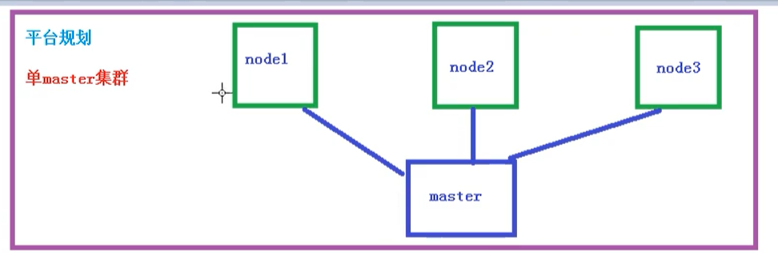

# 使用kubeadm方式搭建K8S集群

kubeadm 是官方社区推出的一个用于快速部署kubernetes 集群的工具。

这个工具能通过两条指令完成一个kubernetes 集群的部署：

```shell
# 创建一个 Master 节点
kubeadm init

# 将一个 Node 节点加入到当前集群中
kubeadm join <Master 节点的IP和端口>
```

## kubeadm方式搭建K8S集群

使用kubeadm 方式搭建K8S集群主要分为以下几步：

- 准备三台虚拟机， 同时安装操作系统CentOS7.x
- 对三个安装操作系统之后的机器进行初始化操作
- 在三个节点安装 docker、kubelet、kubeadm、kubectl
- 在master节点执行kubeadm init 命令初始化
- 在node节点上执行 kubeadm join命令，把node节点添加到集群中
- 配置CNI网络插件，用于节点之间的联通（失败了可以多试几次，主要在于拉取镜像的过程失败，因为镜像在国外）
- 通过部署一个nginx在集群中测试，看看外网是否能正常访问


## 安装要求

在开始之前，部署kubernetes 集群机器需要满足以下几个条件：

- 一台或多台机器，操作系统 CentOS7.x-86_x64
- 硬件配置：2GB或更多RAM，2个CPU或更多CPU，硬盘30GB或更多【注意master需要两核】
- 可以访问外网，需要拉取镜像，如果服务器不能上网，需要提前下载镜像并导入节点
- 禁止swap分区

## 准备环境

| 角色   | IP             |
| ------ | -------------- |
| master | 192.168.10.128 |
| node1  | 192.168.10.129 |
| node2  | 192.168.10.130 |

然后开始在每台机器上执行下面的命令

```shell
# 关闭防火墙
systemctl stop    firewalld
systemctl disabel firewalld

# 关闭seLinux
# 永久关闭
sed -i 's|Selinux=enforcing|Selinux=disabled|g'  /etc/selinux/config

# 临时关闭
setenforce 0

# 关闭swap
# 临时
swapoff -a
# 永久关闭
sed -ri 's/.*swap.*/#&/'  /etc/fstab

# 根据规划设置主机名 【master 节点上操作】
hostnamectl set-hostname k8smaster
# 根据规划设置主机名 【node1 节点操作】
hostnamectl set-hostname k8snode1
# 根据规划设置主机名 【node2 节点操作】
hostnamectl set-hostname k8snode2


# 在master添加hosts
cat >> /etc/hosts << EOF
192.168.10.128 k8smaster
192.168.10.129 k8snode1
192.168.10.130 k8snode2
EOF

# 将桥接的IPv4流量传递到iptables 的链
cat > /etc/sysctl.d/k8s.conf << EOF
net.bridge.bridge-nf-call-ip6tables = 1
net.bridge.bridge-nf-call-iptables = 1
EOF

# 生效
sysctl --system

# 时间同步
yum install ntpdate -y
ntpdate time.windows.com

```

## 安装Docker

所有的节点都要安装Docker，因为kubeadm方式安装k8s，master节点的API Server、Scheduler、Controller-Manager等组件是以Pod的方式启动的。Work节点就不用说了，更需要Docker引擎了。

首先配置Docker的国内的阿里yum源

```shell
cat >/etc/yum.repos.d/docker.repo<<EOF
[docker-ce-edge]
name=Docker CE Edge - \$basearch
baseurl=https://mirrors.aliyun.com/docker-ce/linux/centos/7/\$basearch/edge
enabled=1
gpgcheck=1
gpgkey=https://mirrors.aliyun.com/docker-ce/linux/centos/gpg
EOF		
```

然后yum方式安装最新社区版docker-ce

```shell
# yum安装
yum -y install docker-ce

# 设置docker的开机自启动
systemctl enable docker
# 启动docker
systemctl start docker

# 查看docker版本
docker --version  
```

配置docker镜像源仓库地址

```shell
cat >> /etc/docker/daemon.json << EOF
{
  "registry-mirrors": ["https://b9pmyelo.mirror.aliyuncs.com"]
}
EOF
```

然后重启docker

```shell
systemctl restart docker
```

## 添加kubernetes软件源

```shell
cat > /etc/yum.repos.d/kubernetes.repo << EOF
[kubernetes]
name=Kubernetes
baseurl=https://mirrors.aliyun.com/kubernetes/yum/repos/kubernetes-el7-x86_64
enabled=1
gpgcheck=0
repo_gpgcheck=0
gpgkey=https://mirrors.aliyun.com/kubernetes/yum/doc/yum-key.gpg https://mirrors.aliyun.com/kubernetes/yum/doc/rpm-package-key.gpg
EOF
```

安装kubeadm、kubelet和kubectl

由于版本更新频繁，这里指定版本号部署：

```shell
# 安装kubelet、kubeadm、kubectl，同时指定版本
yum install -y kubelet-1.18.5 kubeadm-1.18.5 kubectl-1.18.5
# 设置开机启动
systemctl enable kubelet
```

## 部署kubernetes Master 【master节点】

在 192.168.10.128 机器上执行，也就是master节点

```shell
kubeadm init --apiserver-advertise-address=192.168.10.128 --image-repository registry.aliyuncs.com/google_containers --kubernetes-version v1.18.5 --service-cidr=10.96.0.0/12  --pod-network-cidr=10.244.0.0/16
```

由于默认拉取镜像地址 `k8s.gcr.io`国内无法访问，这里指定阿里云镜像仓库地址，【执行上述命令需要一些时间，因为需要在后台拉取镜像】，我们可以使用 `kubeadm config images list --kubernetes-version=1.18.5 `  命令查看需要安装哪些镜像:

```shell
root@k8smaster:~/k8s# kubeadm config images list --kubernetes-version=1.18.5
W1120 17:06:53.904807   14527 configset.go:202] WARNING: kubeadm cannot validate component configs for API groups [kubelet.config.k8s.io kubeproxy.config.k8s.io]
k8s.gcr.io/kube-apiserver:v1.18.5
k8s.gcr.io/kube-controller-manager:v1.18.5
k8s.gcr.io/kube-scheduler:v1.18.5
k8s.gcr.io/kube-proxy:v1.18.5
k8s.gcr.io/pause:3.2
k8s.gcr.io/etcd:3.4.3-0
k8s.gcr.io/coredns:1.6.7
# 由于我们修改了拉取阿里云的镜像，所以在后台拉取的都是仓库地址是 
# registry.aliyuncs.com/google_containers/kube-apiserver:v1.18.5
```

当我们出现下面的输出时，说明kubernetes 的镜像已经安装成功

```shell
root@k8smaster1:~# kubeadm init --config=kubeadm-config.yaml | tee kubeadm-init.log
W1120 16:05:33.376158   14342 configset.go:202] WARNING: kubeadm cannot validate component configs for API groups [kubelet.config.k8s.io kubeproxy.config.k8s.io]
[init] Using Kubernetes version: v1.18.5
[preflight] Running pre-flight checks
	[WARNING IsDockerSystemdCheck]: detected "cgroupfs" as the Docker cgroup driver. The recommended driver is "systemd". Please follow the guide at https://kubernetes.io/docs/setup/cri/
[preflight] Pulling images required for setting up a Kubernetes cluster
[preflight] This might take a minute or two, depending on the speed of your internet connection
[preflight] You can also perform this action in beforehand using 'kubeadm config images pull'
[kubelet-start] Writing kubelet environment file with flags to file "/var/lib/kubelet/kubeadm-flags.env"
[kubelet-start] Writing kubelet configuration to file "/var/lib/kubelet/config.yaml"
[kubelet-start] Starting the kubelet
[certs] Using certificateDir folder "/etc/kubernetes/pki"
[certs] Generating "ca" certificate and key
[certs] Generating "apiserver" certificate and key
[certs] apiserver serving cert is signed for DNS names [k8smaster1 kubernetes kubernetes.default kubernetes.default.svc kubernetes.default.svc.cluster.local] and IPs [10.96.0.1 10.30.10.32]
[certs] Generating "apiserver-kubelet-client" certificate and key
[certs] Generating "front-proxy-ca" certificate and key
[certs] Generating "front-proxy-client" certificate and key
[certs] Generating "etcd/ca" certificate and key
[certs] Generating "etcd/server" certificate and key
[certs] etcd/server serving cert is signed for DNS names [k8smaster1 localhost] and IPs [10.30.10.32 127.0.0.1 ::1]
[certs] Generating "etcd/peer" certificate and key
[certs] etcd/peer serving cert is signed for DNS names [k8smaster1 localhost] and IPs [10.30.10.32 127.0.0.1 ::1]
[certs] Generating "etcd/healthcheck-client" certificate and key
[certs] Generating "apiserver-etcd-client" certificate and key
[certs] Generating "sa" key and public key
[kubeconfig] Using kubeconfig folder "/etc/kubernetes"
[kubeconfig] Writing "admin.conf" kubeconfig file
[kubeconfig] Writing "kubelet.conf" kubeconfig file
[kubeconfig] Writing "controller-manager.conf" kubeconfig file
[kubeconfig] Writing "scheduler.conf" kubeconfig file
[control-plane] Using manifest folder "/etc/kubernetes/manifests"
[control-plane] Creating static Pod manifest for "kube-apiserver"
[control-plane] Creating static Pod manifest for "kube-controller-manager"
W1120 16:06:31.511724   14342 manifests.go:225] the default kube-apiserver authorization-mode is "Node,RBAC"; using "Node,RBAC"
[control-plane] Creating static Pod manifest for "kube-scheduler"
W1120 16:06:31.512710   14342 manifests.go:225] the default kube-apiserver authorization-mode is "Node,RBAC"; using "Node,RBAC"
[etcd] Creating static Pod manifest for local etcd in "/etc/kubernetes/manifests"
[wait-control-plane] Waiting for the kubelet to boot up the control plane as static Pods from directory "/etc/kubernetes/manifests". This can take up to 4m0s
[apiclient] All control plane components are healthy after 21.001917 seconds
[upload-config] Storing the configuration used in ConfigMap "kubeadm-config" in the "kube-system" Namespace
[kubelet] Creating a ConfigMap "kubelet-config-1.18" in namespace kube-system with the configuration for the kubelets in the cluster
[upload-certs] Skipping phase. Please see --upload-certs
[mark-control-plane] Marking the node k8smaster1 as control-plane by adding the label "node-role.kubernetes.io/master=''"
[mark-control-plane] Marking the node k8smaster1 as control-plane by adding the taints [node-role.kubernetes.io/master:NoSchedule]
[bootstrap-token] Using token: abcdef.0123456789abcdef
[bootstrap-token] Configuring bootstrap tokens, cluster-info ConfigMap, RBAC Roles
[bootstrap-token] configured RBAC rules to allow Node Bootstrap tokens to get nodes
[bootstrap-token] configured RBAC rules to allow Node Bootstrap tokens to post CSRs in order for nodes to get long term certificate credentials
[bootstrap-token] configured RBAC rules to allow the csrapprover controller automatically approve CSRs from a Node Bootstrap Token
[bootstrap-token] configured RBAC rules to allow certificate rotation for all node client certificates in the cluster
[bootstrap-token] Creating the "cluster-info" ConfigMap in the "kube-public" namespace
[kubelet-finalize] Updating "/etc/kubernetes/kubelet.conf" to point to a rotatable kubelet client certificate and key
[addons] Applied essential addon: CoreDNS
[addons] Applied essential addon: kube-proxy

Your Kubernetes control-plane has initialized successfully!

To start using your cluster, you need to run the following as a regular user:

  mkdir -p $HOME/.kube
  sudo cp -i /etc/kubernetes/admin.conf $HOME/.kube/config
  sudo chown $(id -u):$(id -g) $HOME/.kube/config

You should now deploy a pod network to the cluster.
Run "kubectl apply -f [podnetwork].yaml" with one of the options listed at:
  https://kubernetes.io/docs/concepts/cluster-administration/addons/

Then you can join any number of worker nodes by running the following on each as root:

kubeadm join 192.168.10.128:6443 --token abcdef.0123456789abcdef \
    --discovery-token-ca-cert-hash sha256:c538bdc805cb0a15f870098ed6070c989f0f4cff88e8c5bf3ab6e38ccc9b6ffd 
```

使用kubectl 工具 【master 节点操作】

```shell
mkdir -p $HOME/.kube
sudo cp -i /etc/kubernetes/admin.conf $HOME/.kube/config
sudo chown $(id -u):$(id -g) $HOME/.kube/config
```

执行完成后，我们使用下面命令，查看我们正在运行的节点

```shell
kubectl get nodes
```

能够看到，目前有一个master节点已经运行了，但是还处于未准备状态

下面我们还需要在Node节点执行其他的命令，将node1和node2加入到我们的master节点上。

## 加入kubernetes Node 【Slave节点】

下面我们需要到 k8snode1 和 k8snode2 服务器，执行下面的代码向集群添加新节点

执行在kubeadm init 输出的kubeadm join命令：

> 注意，以下的命令是在master 初始化完成后，每个人都是不同的，需要复制自己生成的

```shell
kubeadm join 192.168.10.128:6443 --token 8j6ui9.gyr4i156u30y80xf \
    --discovery-token-ca-cert-hash sha256:eda1380256a62d8733f4bddf926f148e57cf9d1a3a58fb45dd6e80768af5a500
```

默认token有效期为24小时，当过期之后，该token就不可用了。这时就需要重新创建token，操作如下：

```shell
kubeadm token create --print-join-command
```

当我们把另外两个node加入进来后，我们就可以去 k8smaster 上执行 kubectl get nodes 命令了，但是所有节点的状态都是 NotReady ，因为还没安装网络插件

```shell
kubectl get nodes
```

部署CNI网络插件

上面的状态还是NotReady,我们来安装网络插件，来进行联网访问

```shell
# 下载网络插件配置
wget https://raw.githubusercontent.com/coreos/flannel/master/Documentation/kube-flannel.yml
```

默认镜像地址无法访问，sed命令修改为docker hub镜像仓库。

```shell
# 添加
kubectl apply -f https://raw.githubusercontent.com/coreos/flannel/master/Documentation/kube-flannel.yml

# 查看 kube-system 命名空间下的pod状态 【pod是k8s中的最小单元】
root@k8smaster1:~# kubectl get pods -n kube-system
NAME                                 READY   STATUS    RESTARTS   AGE
coredns-7ff77c879f-27cmx             1/1     Running   21         48d
coredns-7ff77c879f-b55rv             1/1     Running   18         48d
etcd-k8smaster1                      1/1     Running   18         48d
kube-apiserver-k8smaster1            1/1     Running   23         48d
kube-controller-manager-k8smaster1   1/1     Running   26         48d
kube-flannel-ds-2p75c                1/1     Running   0          36d
kube-flannel-ds-bq4dm                1/1     Running   3          36d
kube-flannel-ds-drm64                1/1     Running   2          40d
kube-proxy-2w9hb                     1/1     Running   1          36d
kube-proxy-dl2lj                     1/1     Running   3          40d
kube-proxy-h4w8q                     1/1     Running   2          46d
```

运行完成后，我们查看状态可以发现，已经变成了Ready状态了

```shell
root@k8smaster1:~# kubectl get nodes
NAME         STATUS                     ROLES    AGE   VERSION
k8smaster1   Ready					    master   48d   v1.18.5
k8snode1     Ready                      <none>   48d   v1.18.5
k8snode2     Ready                      <none>   48d   v1.18.5
```

如果上述操作完成后，还存在某个节点处于NotReady状态，可以在Master将该节点删除

```shell
# master节点将该节点删除
kubectl delete node k8snode1
 
# 然后到k8snode1节点进行重置
 kubeadm reset
# 重置完后在加入
kubeadm join 192.168.10.128:6443 --token 8j6ui9.gyr4i156u30y80xf     --discovery-token-ca-cert-hash sha256:eda1380256a62d8733f4bddf926f148e57cf9d1a3a58fb45dd6e80768af5a500
```

测试kubernetes集群

我们都直到K8S是容器化技术，它可以联网去下载镜像，用容器的方式进行启动

在kubernetes集群中创建一个pod，验证是否正常运行：

```shell
# 下载nginx 【会联网拉取nginx镜像】
kubectl create deployment nginx --image=nginx
# 查看状态
kubectl get pod
```

如果我们出现Running 状态的时候，表示已经运行成功了


下面我们就需要将端口暴露出去，让其他外界能够访问

```shell
# 暴露端口
kubectl expose deployment nginx --port=80 --type=NodePort
# 查看一下对外的端口
kubectl get pod,svc
```

能够看到，我们已经成功暴露了80端口到 30529上


我们到我们的宿主机浏览器上，访问如下地址：

```shell
http://192.168.10.128:30529
```


到这里为止，我们就搭建了一个单master的k8s集群




## 错误汇总

### 错误一

在执行kubernetes init 方法的时候，出现这个问题

```shell
error execution phase preflight: [preflight] Some fatal errors occurred:
	[ERROR NumCPU]: the number of available CPUs 1 is less than the required 2
```

是因为VMware 设置的核数为1， 而K8S需要的最低核数应该是2，调整核数重启系统即可


### 错误二

我们在给 k8snode1 节点使用  kubeadm join 命令加入集群时，出现下面错误：

```shell
error execution phase preflight: [preflight] Some fatal errors occurred:
	[ERROR Swap]: running with swap on is not supported. Please disable swap
```

错误原因：未禁用swap交换分区

```shell
# 关闭swap
# 临时
swapoff -a 
# 临时
sed -ri 's/.*swap.*/#&/' /etc/fstab
```

### 错误三

在给 k8snode1 节点使用 kubeadm join 命令的时候，出现以下错误：

```shell
The HTTP call equal to 'curl -sSL http://localhost:10248/healthz' failed with error: Get http://localhost:10248/healthz: dial tcp [::1]:10248: connect: connection refused
```

解决办法，首先需要到 master 节点，创建一个文件

```shell
# 创建文件夹
mkdir /etc/systemd/system/kubelet.service.d

# 创建文件
vim /etc/systemd/system/kubelet.service.d/10-kubeadm.conf

# 添加如下内容
Environment="KUBELET_SYSTEM_PODS_ARGS=--pod-manifest-path=/etc/kubernetes/manifests --allow-privileged=true --fail-swap-on=false"

# 重置
kubeadm reset
```

然后删除刚刚创建的配置目录

```shell
rm -rf $HOME/.kube
```

然后 在 master 重新初始化

```shell
kubeadm init --apiserver-advertise-address=192.168.10.128 --image-repository registry.aliyuncs.com/google_containers --kubernetes-version v1.18.5 --service-cidr=10.96.0.0/12  --pod-network-cidr=10.244.0.0/16
```

初始化完成后，我们在到 k8snode1 节点，执行 kubeadm join 命令, 加入到master

```shell
kubeadm join 192.168.10.128:6443 --token c7a7ou.z00fzlb01d76r37s \
    --discovery-token-ca-cert-hash sha256:9c3f3cc3f726c6ff8bdff14e46b1a856e3b8a4cbbe30cab185f6c5ee453aeea5
```

添加完成后，我们使用下面命令，查看节点是否成功添加

```shell
kubectl get nodes
```

### 错误四

我们在执行查看节点的时候，kubectl get nodes 会出现问题

```shell
Unable to connect to the server: x509: certificate signed by unknown authority (possibly because of "crypto/rsa: verification error" while trying to verify candidate authority certificate "kubernetes")
```

这是因为我们之前创建的配置文件还存在，也就是这些配置

```shell
mkdir -p $HOME/.kube
sudo cp -i /etc/kubernetes/admin.conf $HOME/.kube/config
sudo chown $(id -u):$(id -g) $HOME/.kube/config
```

我们需要做的就是把配置文件删除，然后重新执行一下

```shell
rm -rf $HOME/.kube
```

然后再次创建一下即可：

```shell
mkdir -p $HOME/.kube
sudo cp -i /etc/kubernetes/admin.conf $HOME/.kube/config
sudo chown $(id -u):$(id -g) $HOME/.kube/config
```

这个问题主要是因为我们在执行 kubeadm reset 的时候，没有把 $HOME/.kube 给移除掉，再次创建时就会出现问题了


### 错误五

安装的时候，出现以下错误

```shell
Another app is currently holding the yum lock; waiting for it to exit...
```

是因为 yum 上锁占用，解决办法

```shell
yum -y install docker-ce
```

### 错误六

在使用下面命令，添加 k8snode 节点到集群上的时候

```shell
kubeadm join 192.168.10.128:6443 --token jkcz0t.3c40t0bqqz5g8wsb  --discovery-token-ca-cert-hash sha256:bc494eeab6b7bac64c0861da16084504626e5a95ba7ede7b9c2dc7571ca4c9e5
```

然后出现了这个错误

```shell
[root@k8smaster ~]# kubeadm join 192.168.177.130:6443 --token jkcz0t.3c40t0bqqz5g8wsb     --discovery-token-ca-cert-hash sha256:bc494eeab6b7bac64c0861da16084504626e5a95ba7ede7b9c2dc7571ca4c9e5
W1117 06:55:11.220907   11230 join.go:346] [preflight] WARNING: JoinControlPane.controlPlane settings will be ignored when control-plane flag is not set.
[preflight] Running pre-flight checks
	[WARNING IsDockerSystemdCheck]: detected "cgroupfs" as the Docker cgroup driver. The recommended driver is "systemd". Please follow the guide at https://kubernetes.io/docs/setup/cri/
error execution phase preflight: [preflight] Some fatal errors occurred:
	[ERROR FileContent--proc-sys-net-ipv4-ip_forward]: /proc/sys/net/ipv4/ip_forward contents are not set to 1
[preflight] If you know what you are doing, you can make a check non-fatal with `--ignore-preflight-errors=...`
To see the stack trace of this error execute with --v=5 or higher
```

处于安全考虑，Linux 系统 **默认是禁止数据包转发**的。所谓**转发即当主机拥有多于一块的网卡时，其中一块收到数据包，根据数据包的目的ip地址将包发往本地另一网卡，该网卡根据路由表继续发送数据包**。这通常就是路由器所要实现的功能。也就是说 /proc/sys/net/ipv4/ip_forward 文件的值不支持转发

- 0：禁止
- 1：转发

所以我们需要将值修改成 1 即可

```shell
echo “1” > /proc/sys/net/ipv4/ip_forward
```

修改完成后，重新执行命令即可


