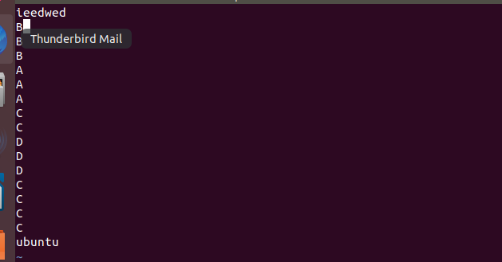
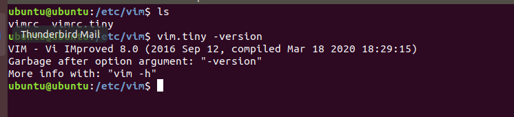

桌面版ubuntu 18.04系统vim编辑器无法正常使用

# 问题描述

新创建的Ubuntu虚拟机，在使用 vi 编辑器时，当使用上下键或者左右键的时候，会出现一些大写的ABCD英文字母。




# 问题原因

实际上Ubuntu默认安装的是 `vim-tiny`版本，并没有老版本的`vi`编辑器，它是`vim`的最小化版本，只包含一部分功能，可以到目录中查看一下，或者执行命令` vim.tiny -version` 看看。



# 解决方案

1. 卸载vim-tiny 命令： 

   ```shell
   sudo apt-get remove vim-common
   ```

   

2. 安装vim-full 命令：

   ```shell
   sudo apt-get install vim
   ```

   

[参考链接](https://blog.csdn.net/weixin_43669045/article/details/104651746)